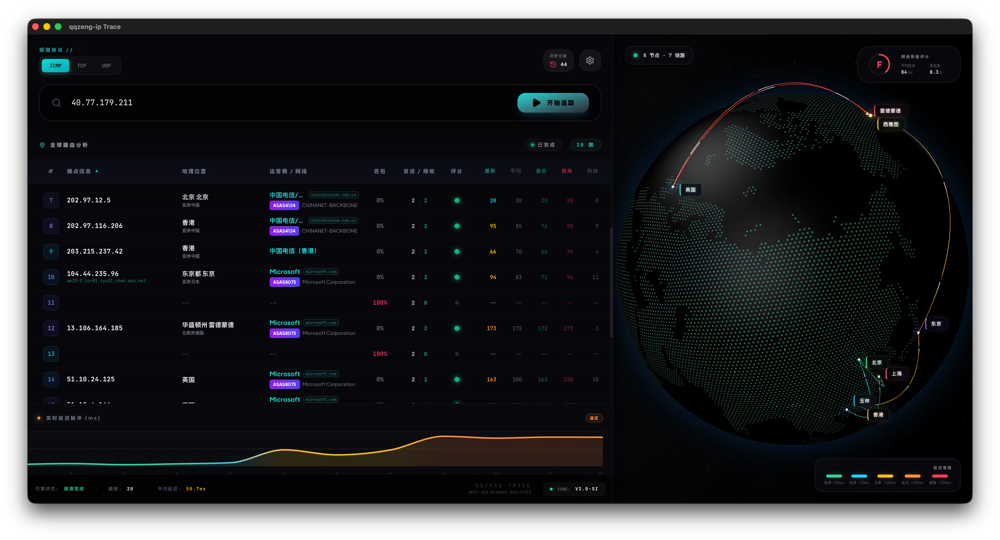

# qqzeng-ip 项目文档

## 👑 旗舰产品：QZDB 下一代极速解析引擎 (Recommended)

> **[进入 QZDB 多语言极速解析 SDK 文档](./qzdb/README_zh.md)**

**QZDB (qqzeng IP Database)** 专注于为企业提供高速、低开销的 IP 地址解析检索方案。
- **极致性能**：Rust / C / Go 基于只读内存映射（mmap）或单次载入实现零分配查询，多版本均可达到**单机微秒级**解析延迟。
- **全量验证**：对全部 `959,162` 个 CIDR 区间的边界及中心 IP 进行了 `2,877,486` 次无抽样全量核对，通过率 **100.00%**。
- **全语言支持**：C, Rust, Go, Java, Node.js, C#, Python, PHP。

| 语言 | 查询模式 | 性能特征 | 适用场景 |
|:---|:---|:---|:---|
| **Rust** | Read-Only Mmap | 零分配查询，mmap 零拷贝 | 高并发服务、嵌入式、安全敏感场景 |
| **C / C++** | Read-Only Mmap | 极致轻量，mmap 零拷贝 | IoT、网关、内核模块、资源受限环境 |
| **Go** | Read-Only Mmap | goroutine 安全，低延迟 | Web 服务、API 网关、微服务 |
| **C#** | Eager-load Once | .NET 原生集成 | .NET 企业应用 |
| **Java** | Eager-load Once | JVM 跨平台部署 | Spring Boot / 大数据生态 |
| **Node.js** | Eager-load Once | 异步非阻塞 | 全栈 JavaScript 应用 |
| **PHP** | Dynamic Parsed | 开箱即用 | Web 项目快速集成 |
| **Python** | Dynamic Parsed | 快速原型验证 | 数据分析、脚本、原型验证 |

---

## 项目简介

**qqzeng-ip** 是一个高性能的 IP 地址数据库解析工具，专注于快速、精准地查询全球 IP 地址的归属地及多维字段信息。新一代 **QZDB** 二进制格式是专为现代云原生、高并发网络环境定制的搜索引擎。

---

## 为什么选择 QZDB 与 CIDR 掩码格式？

* **极致紧凑**：QZDB 二进制压缩率达到 **95%+**，仅十余兆大小即可装载千万级全球 IP 细化记录。
* **CIDR 简化表示**：采用“IP 地址/前缀长度”（如 `192.168.1.0/24`）的标准 CIDR 结构，单个 IP 自动保留，不再使用冗余的起止多列设计，查询与管理更直观。
* **原生 IPv4/IPv6 全支持**：网络工具、防火墙和各类现代数据库天然支持 CIDR 寻址，计算与匹配效率更高。

---

## 📐 QZDB 算法架构与查询复杂度 (Algorithm Architecture)

QZDB 引擎核心采用专门定制的 **双阶段 Patricia Trie 树型检索算法**：
1. **第一阶段 (Jump Table 快速跳级)**：
   * **IPv4**：默认预读 `16-bit` 的静态前缀跳转表（$2^{16} = 65,536$ 个槽位）。根据 IP 的前两字节，直接 $\mathcal{O}(1)$ 跳转定位到 Trie 树的具体子树节点，消除前 16 层的递归遍历。
   * **IPv6**：根据数据量大小动态估算最佳跳转位数 `v6_jump_bits`（通常为 `16~20 bit`），同样实现首阶段的快速降维。
2. **第二阶段 (Trie 节点匹配 & 字符串池偏移读取)**：
   * 在定位到的子树节点中，以最长前缀匹配 (LPM) 算法沿单侧节点向右/向左遍历。所有中间路由指针和叶子节点数据在文件中扁平化连续存放，极具 CPU 缓存友好性。
   * 查询命中后，SDK 会直接根据其物理偏移量（Offset）在预载入的只读字符串池（String Pool）中以 $\mathcal{O}(1)$ 解析最终文本，全程免去临界区上锁（Lock-free）。

| 维度指标 | 复杂度 | 技术细节与优势 |
| :--- | :--- | :--- |
| **检索时间复杂度** | $\mathcal{O}(W - K)$ | 其中 $W$ 为 IP 地址总位数（IPv4 为 32 位，IPv6 为 128 位），$K$ 为首阶段跳转位数（如 16 位）。平均只需 16 次比对即可完成检索。 |
| **空间复杂度** | 极小量级 | 经过前缀压路机压缩，每个 Trie 节点仅占用 6~8 字节，千万级全球 IP 树存储开销低于 20MB。 |
| **内存开销 (Memory)** | $\mathcal{O}(0)$ | 原生编译型语言（Rust/C/Go）直接借助操作系统 `mmap` 进行零拷贝（Zero-copy）寻址，无堆分配与 GC 停顿。 |

---

## ⚖️ 主流二进制 IP 数据格式对比 (Format Comparison)

为了帮助架构师进行技术选型，以下列出了 QZDB 与业界主流二进制 IP 格式设计的客观对比：

| 格式分类 | 检索时间复杂度 | 数据结构体积 | 核心检索树与数据机制 | QZDB 的技术优化点 |
| :--- | :--- | :--- | :--- | :--- |
| **通用嵌套结构树格式 (`.mmdb`)** | $\mathcal{O}(W)$   (需加上反序列化开销) | 较大   (含元数据 Key-Value 冗余) | 经典二进制 Trie；叶子指向嵌套 Map/List 数据区 | **QZDB 首阶段快速跳级 + 零分配**。IPv4 预读 16-bit 跳过前 16 层；叶子基于 Schema 物理偏移，堆内存零分配。 |
| **扁平区间二分格式 (`.bin`)** | $\mathcal{O}(\log N)$   (基于多轮二分匹配) | 中等   (需存储完整起止 IP 范围) | 已排序起止范围二分检索；辅以前缀索引缓存 | **QZDB 的 Trie 压缩与短路径检索**。Trie 树结构天生善于压缩重叠段，平均检索路径大幅缩短。 |
| **分区向量索引格式 (`.xdb`)** | $\mathcal{O}(W)$ 或 $\mathcal{O}(\log N)$   (局部向量二分) | 极小   (一般只索引部分核心地理字段) | 向量索引表 + 局部 B-Tree 区间检索 | **QZDB 对全球超大数据集扩展更佳**。采用全局 RowSchema 与双阶段树设计，能自适应承载从小体积到数行大规模全球网段数据的动态扩展。 |
| **专有前缀树格式 (`.ipdb`)** | $\mathcal{O}(W)$   (多次树节点跳转) | 较小   (索引节点与偏移量较为紧凑) | 前缀节点位移 Trie 检索；索引与数据区分离 | **QZDB 的多语种只读字符串池与完全免锁设计**。多维字段在初始化后即建立只读内存视图，多线程并发检索无锁竞争。 |

---

## 📂 核心产品与目录结构 (Project Structure)

| 目录/文件 | 说明 (Description) |
| :--- | :--- |
| **`qzdb/`** | ⚡ **QZDB 极速解析引擎**——C / Go / Java / Rust / C# / Node.js / PHP / Python 八语言 SDK 全覆盖 |
| **`qqzeng-phone-6.0/`** | 📱 **号段归属地 v6.0**——TXT 压缩 95%→DAT，全平台多语言查询 |
| **`qqzeng-phone-redis/`** | 📱 **号段 Redis 缓存**——高并发 Redis 导入脚本与查询接口 |
| **`mysql/`, `mssql/`, `pgsql/`** | 🗄️ **数据库入库**——MySQL / SQL Server / PostgreSQL DDL 与 IP 数据批处理 |
| **`demo/`** | 📋 **演示样本**——IP 归属地与号段 CSV / TXT 数据一览 |
| **`docs/`** | 📄 **项目文档**——架构设计、接口说明与使用指南 |
| **`qqzeng-ip-6.0/` , `-2.0/`** | 🗂️ **IP 引擎演进**——v2.0 至 v6.0 历史版本 |
| **`qqzeng-phone-5.0/` ~ `-2.0/`** | 🗂️ **号段引擎演进**——v2.0 至 v5.0 历史版本 |
| **`archive/`** | 🗂️ **设计归档**——历史设计稿、资料与附件 |

### 数据交付格式与产品规格 (Data Delivery Formats & Specifications)

| 格式分类 | 主要内容 | 文件大小 (以国内/全球版为例) | 查询性能 | 适用场景 |
| :--- | :--- | :--- | :--- | :--- |
| **QZDB 二进制 (.qzdb)** | 包含 24-bit Trie 树索引、动态元数据与多语种压缩字符串池。 | **9.5 MB** (国内版) / **160 MB** (全球版) | 内存映射读取，微秒级响应 | 高并发 Web 服务、防火墙网关、DNS 调度。支持 `mmap` 零拷贝加载。 |
| **CSV 文本 (.csv / .txt)** | 标准 CIDR 掩码文本，每行按大洲/国家/省/市/区/经纬度扁平展开。 | **11 MB** (国内版) / **204 MB** (全球版) | 取决于底层数据库性能 | 离线数仓 ETL、报表分析。支持一键批量导入 MySQL, PostgreSQL, SQL Server。 |

### IP 数据库产品划分与字段规格 (Database Editions & Fields)

依据项目官方权威规范（5 版本 × 2 区域 × 3 协议），本系列提供五个核心产品版本，各版本维度池及 CSV/QZDB 列字段定义如下：

| 版本 | 维度池数 | 核心定位 | 字段构成列表 (按规范排序顺序) |
| :--- | :---: | :--- | :--- |
| **`std` 标准版** | **6** | 基础地理 + 运营商 | `continent`, `country_code`, `country`, `province`, `city`, `isp` |
| **`pro` 专业版** | **11** | 细粒度地理定位 | `std` 字段 + `district`, `geo_id`, `longitude`, `latitude`, `timezone` |
| **`asn` ASN 路由版** | **8** | 网络专项（无细粒度地理）| `continent`, `country_code`, `country`, `isp`, `asn`, `as_name`, `as_domain`, `usage_type` |
| **`max` 旗舰版** | **15** | 地理 + 路由 + 风控应用 | `pro` 字段 + `asn`, `as_name`, `as_domain`, `usage_type` |
| **`ult` 至尊版** | **25** | 全维度 (地理/英文/风控等) | `max` 字段 + 10 个英文扩展项（`continent_en`, `country_alpha3`, `country_en`, `province_en`, `city_en`, `district_en`, `languages`, `currency_code`, `phone_prefix`, `emoji_flag`） |

> **字段设计说明**：
> * **规范物理排序**：各版本在导出为 CSV 或构建 QZDB 时均遵循统一的「规范顺序」内插平铺（如英文扩展项 `_en` 紧随对应中文项，ASN 与应用场景位放置于末尾）。
> * **应用场景分类 `usage_type`**：使用英文字符串存储网络应用场景分类值（如 `Broadband`、`DataCenter`、`VPN`、`Cloud`、`Spider`、`Reserved` 等），SDK 直接读取字符串无需位运算解码。
> * **老客户无缝迁移说明**：旧版旗舰版（Ultimate 历史在售版为 11 维，仅地理无 ASN）的数据结构与当前的全新的 **`pro` 专业版 (11 维)** 完全一致，历史购入旗舰版的用户可直接无缝对应迁移至新版的 **`pro` 专业版** ；全新版本的 **`max` 旗舰版** 则升级为 15 维（融入了网络 ASN 自治域与应用场景分类）。

---

## 🗺️ 数据多维层级与字段规范 (Data Dimensions & Schema)

QZDB 最新版支持动态字段拓扑（Schema），各版本通过标准的 CSV 扁平网段与 QZDB 二进制树提供一致的物理交付。典型多维字段定义如下：

| 字段类别 | 标准命名 | 数据格式示例 | 技术规范与参考标准 |
| :--- | :--- | :--- | :--- |
| **空间地理层** | `大洲` / `国家` / `省份` / `城市` / `区县` | `亚洲` / `中国` / `广东` / `深圳` / `南山` | 符合国家民政部 GB/T 2260 行政区划划分；国外细化至州/邦/郡/市级 |
| **英文与出境层**| `国家英文` / `国家二位代码` | `China` / `CN` | 符合国际标准化组织 ISO 3166-1 Alpha-2 规范 |
| **网络服务层** | `运营商` | `电信` / `联通` / `移动` / `阿里云` / `AWS` | 支持全球主流 ISP 节点与各大主流云服务商 IDC 网段标记 |
| **位置投影层** | `经纬度` | `113.930478,22.53332` | 基于 WGS-84 坐标系，提供高精度十进制经纬度 |
| **时间与时区层**| `时区` | `Asia/Shanghai` | 符合 IANA Time Zone Database (TZDB) 标准时区名称 |
| **行政属性层** | `区域代码` | `440305` | 中国六位标准行政代码（地方识别码与行政区划代码） |

---

## 🎯 典型应用场景与用途 (Application Scenarios)

### 1. DNS 智能解析
* **国内运营商线路**：支持按电信、联通、移动、教育网、鹏博士、广电网等智能解析，细分到省份。
* **海外地区线路**：细分到大洲、国家。
* **自定义控制策略**：基于 IPTables 的高级访问控制 (ACL)，设置 Allow from / Deny from 规则。
* **多维度网络接入**：支持识别阿里云、腾讯云、华为云、亚马逊/Amazon、微软/Microsoft、谷歌/Google 等主流云服务商网段。

### 2. 核心业务用途
* **内容分发与 CDN 差异化**：基于用户地理位置采用差异化内容分发策略，保障就近访问以提升用户访问体验。
* **精准定点投放**：依赖高精度地理位置数据库实现区域化精准定点投放，提高触达率并优化运营成本。
* **智能网络流量调度**：在高效流量调度、智能 DNS 服务、网络服务质量监测等环节起到基础支撑作用。
* **统计分析与行为决策**：多维度分析区域流量数据，研判不同地域的用户访问行为，为制定网络策略提供决策依据。
* **多领域业务安全防护**：广泛应用于地理位置识别、安全防护、网络管理、内容分发、电子商务等各领域企业。

---

# IP Search Performance Tests

> **最新测试结果请查看 [QZDB 性能评测](./qzdb/README_zh.md#%E6%A0%B8%E5%BF%85%E4%BA%AE%E7%82%B9%E4%B8%8E%E7%9C%9F%E5%AE%9E%E6%80%A7%E8%83%BD%E5%9F%BA%E5%87%86%E6%B5%8B%E8%AF%95)**

## 历史版本对比 (随机亿级测试)

| 方法                 | 总次数       | 测试时间    | 每秒查询率 (QPS)     | 提升倍数 |
|----------------------|--------------|---------|----------|---|
| qqzeng-ip-search-2.0 | 1.64 亿 | 17.29 秒 | **9.48 M** | 1.0x |
| qqzeng-ip-search-3.0 | 1.70 亿 | 10.95 秒 | **15.53 M** | ~1.6x |
| **qqzeng-ip-qzdb (当前最新版)** | **1.75 亿** | **5.68 秒** | **30.80 M** | **~3.2x** |

*(注：上述基准测试基于多核并发内存检索，不包含网络与磁盘 I/O 延迟。详情与单线程测试结果请查看 qzdb 目录说明)*

---

## 手机号段归属地-多语言解析以及导入数据库脚本

qqzeng-phone-6.0.dat    [6.0版本](./qqzeng-phone-6.0/)   

字段信息：  
广东|深圳|518000|0755|440300|移动   

编码：UTF8  字节序：Little-Endian  

### 存储与性能

#### 压缩效果  
| **版本** | **格式** | **体积** | **压缩率** |  
|----------|----------|----------|-------------|  
| 原始数据 | TXT      | 30 MB    | -           |  
| v6.0     | DAT      | 1.28 MB  | ▸ 95.7%     |  
| v3.0     | DAT      | 1.95 MB  | ▸ 93.5%     |  
| v2.0     | DAT      | 2.40 MB  | ▸ 92.0%     |  

#### 性能说明  
- **解析速度**：超5,000万次/秒（较传统方案快200%）  
- **资源占用**：内存消耗<10MB，适配高并发场景  
- **架构优势**：二进制DAT格式实现近O(1)时间复杂度查询   

### 号段归属地查询性能对比（2.0-6.0版本）

#### 测试环境与指标
- **测试硬件**：Apple M4 Max，14核 CPU
- **测试年份**：2025
- **时间复杂度**：已从早期版本的 `O(log n)` 优化到近期的 `O(1)`，查询效率大幅度跃升。

#### 历史版本性能对比

| 版本 | 文件格式 | 时间复杂度 | QPS (测试环境: Apple M4 Max) |
| :--- | :--- | :--- | :--- |
| **v6.0** (最新版) | `.db` (SQLite/Bolt) | **O(1)** | 1.66 亿 |
| **v5.0** | `.dat` | **O(1)** | 2.12 亿 |
| **v4.0** | `.dat` | **O(log n)** | 6,178 万 |
| **v3.0** | `.dat` | **O(log n)** | 2,924 万 |
| **v2.0** | `.dat` | **O(log n)** | 1,380 万 |

*注：随着号段结构和树形节点跳转的优化，高版本号段库在单机环境下的查询耗时近乎恒定。*

---

演示  https://www.qqzeng.com/ip

统计  https://www.qqzeng.com/tongji.html

官网  https://www.qqzeng.com   

# 未来  
**qqzeng-ip** 我们持续更新和完善数据库，以提供更加准确和精细，高性能的产品。

