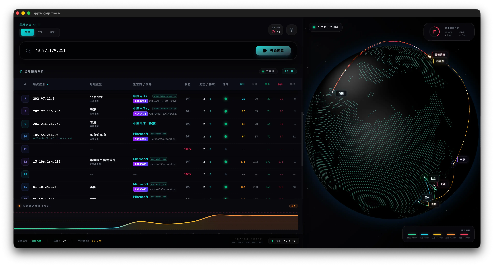

# 👑 qqzeng-ip / QZDB 极速 IP 地理位置解析引擎

<div align="center">

[](https://github.com/zengzhan/qqzeng-ip)
[](https://github.com/zengzhan/qqzeng-ip)
[](https://github.com/zengzhan/qqzeng-ip)
[](./LICENSE)

**官方包已发布至各大平台，开箱即用 👇**

[](https://central.sonatype.com/artifact/com.qqzeng/qzdb)
[](https://www.nuget.org/packages/QQZeng.Qzdb)
[](https://pypi.org/project/qzdb/)
[](https://www.npmjs.com/package/@qqzengip/qzdb)
[](https://crates.io/crates/qzdb)
[](https://packagist.org/packages/qqzeng/qzdb)
[](https://pkg.go.dev/github.com/zengzhan/qqzeng-ip/ip-qzdb-sdk/go)

</div>

> **QZDB (qqzeng IP Database)** 是一款专为企业级高并发、云原生架构打造的下一代 IP 地理位置与号段归属地二进制搜索引擎。凭借**双阶段 Patricia Trie 树算法**、**`mmap` 零拷贝**以及**无锁并发设计**，提供单机微秒级响应与超高吞吐。

---

> [!IMPORTANT]
> **🚀 为什么选择 QZDB 旗舰解析引擎？**
> - ⚡ **极致性能**：Rust / C / Go 基于只读内存映射（mmap）实现零堆分配查询，单次解析延迟低至 **< 0.08 µs (80 纳秒)**。
> - 🛡️ **全量无抽样验证**：对全部 `959,162` 个 CIDR 区间的边界及中心 IP 进行了 **`2,877,486` 次无抽样全量核对**，通过率 **100.00%**。
> - 📦 **高密存储**：Trie 树前缀压路机算法，千万级全球 IP/CIDR 细化网段体积压缩率高达 **95%+**（仅十余兆）。
> - 🌐 **全语言原生 SDK**：官方提供 Rust, C/C++, Go, Java, C#, Node.js, PHP, Python 八种主流语言支持。

---

## 📑 目录 (Table of Contents)

| 章节 | 你会看到什么 |
| :--- | :--- |
| [⚡ 30 秒快速集成](#-30-秒快速集成-quick-start) | 8 语言一键安装命令 + Hello World 示例（**新用户从这里开始**） |
| [🧭 核心产品线一键直达](#-核心产品线一键直达-product-navigation) | IP / 号段 / 数据库 / 历史版本五大产品入口 |
| [📊 多语言 SDK 性能榜单](#-多语言-sdk-性能横向评测榜单-sdk-benchmark) | 8 语言吞吐与延迟实测对比 |
| [📐 算法架构与查询流程](#-qzdb-算法架构与查询流程-algorithm-architecture) | 双阶段 Patricia Trie + Jump Table 原理 |
| [⚖️ 主流二进制格式对比](#️-主流二进制-ip-数据格式对比-format-comparison) | 与 `.mmdb` / `.xdb` / `.ipdb` 的客观选型对比 |
| [📂 目录结构与数据规格](#-核心产品与目录结构-project-structure) | 仓库结构、文件体积、五个版本字段定义 |
| [🗺️ 数据字段规范](#️-数据多维层级与字段规范-data-dimensions--schema) | 大洲/国家/省市/经纬度/时区/运营商字段标准 |
| [🎯 典型应用场景](#-典型应用场景与用途-application-scenarios) | DNS 智能解析、CDN 调度、风控等落地场景 |
| [📱 手机号段归属库](#-手机号段归属地数据库-phone-location-database) | 50 万+ 号段 DAT 与 Redis 方案 |

---

## 🧭 核心产品线一键直达 (Product Navigation)

| 产品线 | 说明与核心亮点 | 包含内容 / 支持语言 | 快速入口 |
| :--- | :--- | :--- | :---: |
| 🚀 **IP 旗舰 QZDB 解析 SDK** | **下一代旗舰**：双阶段 Trie 树 + `mmap` 零分配，微秒级响应，支持 IPv4/IPv6 全字段与风控 | 🦀 Rust · 🐹 Go · ☕ Java · ⚡ C/C++ <br> 🔷 C# · 🟩 Node · 🐍 Python · 🐘 PHP | 👉 [**`ip-qzdb-sdk/`**](./ip-qzdb-sdk) |
| 📦 **IP 经典版解析 SDK** | **经典在用**：6.0 经典 `.db` 与 2.0 早期 `.dat` 格式多语言解析 SDK 与源码 | v6.0 (.db) SDK · v2.0 (.dat) SDK | 👉 [**`ip-classic-sdk/`**](./ip-classic-sdk) |
| 📱 **手机号段归属地 SDK** | **50万+ 全号段**：压缩率 95.7%+ 的二进制 DAT 解析及 Redis 高并发缓存方案 | v2.0 ~ v6.0 DAT SDK · Redis 导入 | 👉 [**`phone-location-sdk/`**](./phone-location-sdk) |
| 🗄️ **关系型数据库脚本** | **海量入库 DDL**：针对 IP 网段与号段优化的建表、前缀索引与批量高速入库脚本 | 🐬 MySQL · 🐘 PostgreSQL · 🪟 SQL Server | 👉 [**`database-sql/`**](./database-sql) |
| 🗂️ **IP 历史版本与工具** | **演进留档**：IP 3.0~5.0 早期版本解析、Big DAT 与 Windows 离线查询工具 | v3.0~v5.0 源码 · 桌面查询工具 | 👉 [**`ip-history-sdk/`**](./ip-history-sdk) |
| 📋 **脱敏测试样本数据** | **演示样例**：IP 归属地与号段 CSV / TXT / QZDB 样例数据 | 全国/全球 IP 样例 · 号段样例 | 👉 [**`demo/`**](./demo) |

---

## 📊 多语言 SDK 性能横向评测榜单 (SDK Benchmark)

| 排名 | 语言 | 查询模式 | 单线程吞吐量 (Ops/sec) | 平均查询延迟 | 性能评价 | 获取方式 |
| :---: | :--- | :--- | :--- | :--- | :--- | :--- |
| **1** | **Rust** | Read-Only Mmap | **10.0 M+ ~ 18.0 M+** | **< 0.08 µs** | 🛡️ 极速安全 · 生产推荐 | [📦 crates.io](https://crates.io/crates/qzdb) · [源码](./ip-qzdb-sdk/rust) |
| **2** | **C / C++** | Read-Only Mmap | **10.0 M+ ~ 18.0 M+** | **< 0.08 µs** | 👑 极致轻量 · 生产推荐 | [源码直编](./ip-qzdb-sdk/c) |
| **3** | **Go** | Read-Only Mmap | **8.0 M+ ~ 12.0 M+** | **< 0.10 µs** | ⚡ 高并发 · 生产推荐 | [📦 pkg.go.dev](https://pkg.go.dev/github.com/zengzhan/qqzeng-ip/ip-qzdb-sdk/go) · [源码](./ip-qzdb-sdk/go) |
| **4** | **C#** | Eager-load Once | **6.0 M+ ~ 10.5 M+** | **< 0.15 µs** | 🚀 优秀 · 生产推荐 | [📦 NuGet](https://www.nuget.org/packages/QQZeng.Qzdb) · [源码](./ip-qzdb-sdk/netcore) |
| **5** | **Java** | Eager-load Once | **5.0 M+ ~ 8.0 M+** | **< 0.20 µs** | ☕ 稳健 · 生产推荐 | [📦 Maven Central](https://central.sonatype.com/artifact/com.qqzeng/qzdb) · [源码](./ip-qzdb-sdk/java) |
| **6** | **Node.js** | Eager-load Once | **3.0 M+ ~ 5.0 M+** | **< 0.33 µs** | 🔥 优异 · 生产推荐 | [📦 npm](https://www.npmjs.com/package/@qqzengip/qzdb) · [源码](./ip-qzdb-sdk/nodejs) |
| **7** | **PHP** | Dynamic Parsed | **100 K+ ~ 2.0 M+** | **< 0.90 µs** | 🐘 实用 · 生产推荐 | [📦 Packagist](https://packagist.org/packages/qqzeng/qzdb) · [源码](./ip-qzdb-sdk/php) |
| **8** | **Python** | Dynamic Parsed | **100 K+ ~ 2.2 M+** | **< 0.90 µs** | 🐍 标准 · 生产推荐 | [📦 PyPI](https://pypi.org/project/qzdb/) · [源码](./ip-qzdb-sdk/python) |

> 除 C / C++ 走源码直编外，其余 7 种语言均可通过各自包管理器一条命令安装，**无需克隆本仓库**。

*(注：基准测试基于普通 x86_64 / ARM64 处理器单线程单核内存检索测试，不同 CPU 频率及物理内存带宽下测试数值可能有所浮动，仅供技术选型参考)*

---

## ⚡ 30 秒快速集成 (Quick Start)

**无需克隆源码**——QZDB SDK 已发布至各语言官方包仓库，一条命令即可接入。

### 📦 官方包一键安装

| 语言 | 包仓库 | 安装命令 |
| :--- | :--- | :--- |
| 🐍 **Python** | PyPI | `pip install qzdb` |
| 🦀 **Rust** | crates.io | `cargo add qzdb` |
| 🐹 **Go** | Go Module | `go get github.com/zengzhan/qqzeng-ip/ip-qzdb-sdk/go` |
| 🔷 **C#** | NuGet | `dotnet add package QQZeng.Qzdb` |
| 🟢 **Node.js** | npm | `npm i @qqzengip/qzdb` |
| 🐘 **PHP** | Packagist | `composer require qqzeng/qzdb` |
| ☕ **Java** | Maven Central | 见下方依赖片段 |
| ⚡ **C / C++** | 源码集成 | 下载 [`qzdb_reader.c`](./ip-qzdb-sdk/c/qzdb_reader.c) + [`qzdb_reader.h`](./ip-qzdb-sdk/c/qzdb_reader.h) 一起编译 |

<details>
<summary>☕ Java 的 Maven / Gradle 依赖片段</summary>

Maven：

```xml
<dependency>
    <groupId>com.qqzeng</groupId>
    <artifactId>qzdb</artifactId>
    <version>1.0.6</version>
</dependency>
```

Gradle：

```groovy
implementation 'com.qqzeng:qzdb:1.0.6'
```

</details>

### 🚀 Hello World（8 语言）

八种语言的 API 设计保持一致：**一次加载、长期持有实例、无锁并发查询**。

<details open>
<summary>🐍 Python</summary>

```python
from qzdb import QzdbReader

searcher = QzdbReader("qqzeng_ip_ult_china.qzdb")

# 返回竖线分隔字符串
print(searcher.find_str("114.114.114.114"))
# 亚洲|CN|中国|江苏|南京|中国电信

# 返回结构化 GeoInfo
loc = searcher.find("114.114.114.114")
if loc:
    print(loc.country, loc.province, loc.city, loc.isp)
```

</details>

<details>
<summary>🦀 Rust</summary>

```rust
use qzdb::QzdbReader;

// from_file 走只读 mmap，返回 Result —— 请在启动期用 ? / match 处理
let searcher = QzdbReader::from_file("qqzeng_ip_ult_china.qzdb")?;

if let Some(loc) = searcher.find("114.114.114.114") {
    // 类型化字段访问（O(1)，零分配）
    println!("Country: {}, City: {}", loc.country(), loc.city());
    // 动态字段访问
    println!("ISP: {}", loc.get("isp"));
}
```

</details>

<details>
<summary>🐹 Go</summary>

```go
import (
    "fmt"
    "log"

    "github.com/zengzhan/qqzeng-ip/ip-qzdb-sdk/go/qzdb"
)

// 创建并持有 QzdbReader 实例（mmap 零拷贝，全局复用）
searcher, err := qzdb.Open("qqzeng_ip_ult_china.qzdb", 0, true)
if err != nil {
    log.Fatal(err)
}
defer searcher.Close()

// 返回竖线分隔字符串
fmt.Println(searcher.FindStr("114.114.114.114"))

// 返回结构化 GeoInfo
info, err := searcher.Find("114.114.114.114")
if err == nil && info != nil {
    fmt.Println(info.GetCountry(), info.GetProvince(), info.GetCity())
}
```

</details>

<details>
<summary>☕ Java</summary>

```java
import com.qqzeng.qzdb.QzdbReader;
import com.qqzeng.qzdb.GeoInfo;

// Builder 模式，支持 groupIndex / verifyCrc
try (QzdbReader reader = new QzdbReader.Builder(new File("qqzeng_ip_ult_china.qzdb")).build()) {
    GeoInfo loc = reader.find("114.114.114.114").orElse(null);
    if (loc != null) {
        System.out.println(loc.getCountry() + " " + loc.getProvince() + " " + loc.getCity());
    }
    System.out.println(reader.findStr("114.114.114.114"));
}
```

</details>

<details>
<summary>🔷 C# (.NET)</summary>

```csharp
using QQZeng.Qzdb;

using var reader = QzdbReader.Open("qqzeng_ip_ult_china.qzdb");
GeoInfo loc = reader.Find("114.114.114.114");
if (loc != null) {
    // 类型化取值
    Console.WriteLine("Province: " + loc.GetProvince());
    // 动态字段访问
    Console.WriteLine("ISP: " + loc.Get("isp"));
}
```

</details>

<details>
<summary>🟢 Node.js</summary>

```javascript
const QzdbReader = require('@qqzengip/qzdb');

const reader = new QzdbReader.Builder("qqzeng_ip_ult_china.qzdb").build();
const loc = reader.find("114.114.114.114");
console.log(loc.get("country"), loc.get("city"));
```

</details>

<details>
<summary>🐘 PHP</summary>

```php
require_once __DIR__ . '/vendor/autoload.php';
use Qqzeng\Ip\QzdbReader;

$reader = new QzdbReader("qqzeng_ip_ult_china.qzdb");
$loc = $reader->find("114.114.114.114");
echo $loc->get('country') . ' ' . $loc->get('city');
```

</details>

<details>
<summary>⚡ C / C++</summary>

```c
#include "qzdb_reader.h"

qzdb_reader_t searcher;
qzdb_init(&searcher, "qqzeng_ip_ult_china.qzdb");   // 栈上持有实例
char buf[256];
qzdb_find_str(&searcher, "114.114.114.114", buf, sizeof(buf));
printf("Result: %s\n", buf);
```

</details>

> 更完整的 API 文档、错误处理与多语言用例，请参见 **[QZDB 多语言 SDK 指南](./ip-qzdb-sdk/README_zh.md)**。

---

## 📐 QZDB 算法架构与查询流程 (Algorithm Architecture)

QZDB 引擎核心采用专门定制的 **双阶段 Patricia Trie 树型检索算法**：


```mermaid
flowchart LR
    A["输入目标 IP (如 114.114.114.114)"] --> B["阶段1: Jump Table 前缀跳级 (16-bit 静态表定位)"]
    B --> C["阶段2: Patricia Trie LPM 匹配 (只读内存按位遍历)"]
    C --> D["阶段3: String Pool 物理偏移 (O1 无锁读取)"]
    D --> E["输出结果 (中国|江苏|南京|中国电信)"]
```

1. **第一阶段 (Jump Table 快速跳级)**：
   * **IPv4**：默认预读 `16-bit` 的静态前缀跳转表（$2^{16} = 65,536$ 个槽位）。根据 IP 的前两字节，直接 $\mathcal{O}(1)$ 跳转定位到 Trie 树的具体子树节点，消除前 16 层的递归遍历。
   * **IPv6**：根据数据量大小动态估算最佳跳转位数 `v6_jump_bits`（通常为 `16~20 bit`），同样实现首阶段的快速降维。
2. **第二阶段 (Trie 节点匹配 & 字符串池偏移读取)**：
   * 在定位到的子树节点中，以最长前缀匹配 (LPM) 算法沿单侧节点向右/向左遍历。所有中间路由指针和叶子节点数据在文件中扁平化连续存放，极具 CPU 缓存友好性。
   * 查询命中后，SDK 会直接根据其物理偏移量（Offset）在预载入的只读字符串池（String Pool）中以 $\mathcal{O}(1)$ 解析最终文本，全程免去临界区上锁（Lock-free）。

| 维度指标 | 复杂度 | 技术细节与优势 |
| :--- | :--- | :--- |
| **检索时间复杂度** | $\mathcal{O}(W - K)$ | 其中 $W$ 为 IP 地址总位数（IPv4 为 32 位，IPv6 为 128 位），$K$ 为首阶段跳转位数（如 16 位）。平均只需 16 次比对即可完成检索。 |
| **空间复杂度** | 极小量级 | 经过前缀压路机压缩，每个 Trie 节点仅占用 6~8 字节，千万级全球 IP 树存储开销低于 20MB。 |
| **内存开销 (Memory)** | $\mathcal{O}(0)$ | 原生编译型语言（Rust/C/Go）直接借助操作系统 `mmap` 进行零拷贝（Zero-copy）寻址，无堆分配与 GC 停顿。 |

---

## ⚖️ 主流二进制 IP 数据格式对比 (Format Comparison)

为了帮助架构师进行技术选型，以下列出了 QZDB 与业界主流二进制 IP 格式设计的客观对比（详细基准报告见 [`docs/benchmark-comparison.md`](./docs/benchmark-comparison.md)）：

| 格式分类 | 检索时间复杂度 | 数据结构体积 | 核心检索树与数据机制 | QZDB 的技术优化点 |
| :--- | :--- | :--- | :--- | :--- |
| **通用嵌套结构树格式 (`.mmdb`)** | $\mathcal{O}(W)$ <br> (需加上反序列化开销) | 较大 <br> (含元数据 Key-Value 冗余) | 经典二进制 Trie；叶子指向嵌套 Map/List 数据区 | **QZDB 首阶段快速跳级 + 零分配**。IPv4 预读 16-bit 跳过前 16 层；叶子基于 Schema 物理偏移，堆内存零分配。 |
| **扁平区间二分格式 (`.bin`)** | $\mathcal{O}(\log N)$ <br> (基于多轮二分匹配) | 中等 <br> (需存储完整起止 IP 范围) | 已排序起止范围二分检索；辅以前缀索引缓存 | **QZDB 的 Trie 压缩与短路径检索**。Trie 树结构天生善于压缩重叠段，平均检索路径大幅缩短。 |
| **分区向量索引格式 (`.xdb`)** | $\mathcal{O}(W)$ 或 $\mathcal{O}(\log N)$ <br> (局部向量二分) | 极小 <br> (一般只索引部分核心地理字段) | 向量索引表 + 局部 B-Tree 区间检索 | **QZDB 对全球超大数据集扩展更佳**。采用全局 RowSchema 与双阶段树设计，能自适应承载从小体积到数行大规模全球网段数据的动态扩展。 |
| **专有前缀树格式 (`.ipdb`)** | $\mathcal{O}(W)$ <br> (多次树节点跳转) | 较小 <br> (索引节点与偏移量较为紧凑) | 前缀节点位移 Trie 检索；索引与数据区分离 | **QZDB 的多语种只读字符串池与完全免锁设计**。多维字段在初始化后即建立只读内存视图，多线程并发检索无锁竞争。 |

---

## 📂 核心产品与目录结构 (Project Structure)

| 目录/文件 | 说明 (Description) |
| :--- | :--- |
| **[`ip-qzdb-sdk/`](./ip-qzdb-sdk)** | ⚡ **QZDB 极速解析引擎**——Rust / C / Go / Java / C# / Node.js / PHP / Python 八语言 SDK 全覆盖 |
| **[`ip-classic-sdk/`](./ip-classic-sdk)** | 📦 **IP 数据库经典版 SDK**——v6.0 (.db) 与 v2.0 (.dat) 经典在用解析源码 |
| **[`phone-location-sdk/`](./phone-location-sdk)** | 📱 **手机号段归属地 SDK**——v2.0 至 v6.0 全版本多语言 DAT 解析 SDK 与 Redis 方案 |
| **[`database-sql/`](./database-sql)** | 🗄️ **数据库建表与入库脚本**——MySQL / PostgreSQL / SQL Server DDL 与高速导入脚本 |
| **[`ip-history-sdk/`](./ip-history-sdk)** | 🗂️ **IP 历史版本与工具归档**——v3.0~v5.0 历史源码、Big DAT 与桌面离线查询工具 |
| **[`demo/`](./demo)** | 📋 **演示样本**——IP 归属地与号段 CSV / TXT / QZDB 数据样例 |
| **[`docs/`](./docs)** | 📄 **项目文档与基准**——架构设计、性能基准报告与维护指南 |

### 数据交付格式与产品规格 (Data Delivery Formats & Specifications)

| 格式分类 | 主要内容 | 文件大小 (以国内/全球版为例) | 查询性能 | 适用场景 |
| :--- | :--- | :--- | :--- | :--- |
| **QZDB 二进制 (.qzdb)** | 包含 24-bit Trie 树索引、动态元数据与多语种压缩字符串池。 | **9.5 MB** (国内版) / **160 MB** (全球版) | 内存映射读取，微秒级响应 | 高并发 Web 服务、防火墙网关、DNS 调度。支持 `mmap` 零拷贝加载。 |
| **CSV 文本 (.csv / .txt)** | 标准 CIDR 掩码文本，每行按大洲/国家/省/市/区/经纬度扁平展开。 | **11 MB** (国内版) / **204 MB** (全球版) | 取决于底层数据库性能 | 离线数仓 ETL、报表分析。支持一键批量导入 MySQL, PostgreSQL, SQL Server。 |

### IP 数据库产品划分与字段规格 (Database Editions & Fields)

依据项目官方权威规范（5 版本 × 2 区域 × 3 协议），本系列提供五个核心产品版本，各版本维度池及 CSV/QZDB 列字段定义如下：

| 版本 | 维度池数 | 核心定位 | 字段构成列表 (按规范排序顺序) |
| :--- | :---: | :--- | :--- |
| **`std` 标准版** | **6** | 基础地理 + 运营商 | `continent`, `country_code`, `country`, `province`, `city`, `isp` |
| **`pro` 专业版** | **11** | 细粒度地理定位 | `std` 字段 + `district`, `geo_id`, `longitude`, `latitude`, `timezone` |
| **`asn` ASN 路由版** | **8** | 网络专项（无细粒度地理）| `continent`, `country_code`, `country`, `isp`, `asn`, `as_name`, `as_domain`, `usage_type` |
| **`max` 旗舰版** | **15** | 地理 + 路由 + 风控应用 | `pro` 字段 + `asn`, `as_name`, `as_domain`, `usage_type` |
| **`ult` 至尊版** | **25** | 全维度 (地理/英文/风控等) | `max` 字段 + 10 个英文扩展项（`continent_en`, `country_alpha3`, `country_en`, `province_en`, `city_en`, `district_en`, `languages`, `currency_code`, `phone_prefix`, `emoji_flag`） |

> **字段设计说明**：
> * **规范物理排序**：各版本在导出为 CSV 或构建 QZDB 时均遵循统一的「规范顺序」内插平铺（如英文扩展项 `_en` 紧随对应中文项，ASN 与应用场景位放置于末尾）。
> * **应用场景分类 `usage_type`**：使用英文字符串存储网络应用场景分类值（如 `Broadband`、`DataCenter`、`VPN`、`Cloud`、`Spider`、`Reserved` 等），SDK 直接读取字符串无需位运算解码。
> * **老客户无缝迁移说明**：旧版旗舰版（Ultimate 历史在售版为 11 维，仅地理无 ASN）的数据结构与当前的全新的 **`pro` 专业版 (11 维)** 完全一致，历史购入旗舰版的用户可直接无缝对应迁移至新版的 **`pro` 专业版** ；全新版本的 **`max` 旗舰版** 则升级为 15 维（融入了网络 ASN 自治域与应用场景分类）。

---

## 🗺️ 数据多维层级与字段规范 (Data Dimensions & Schema)

QZDB 最新版支持动态字段拓扑（Schema），各版本通过标准的 CSV 扁平网段与 QZDB 二进制树提供一致的物理交付。典型多维字段定义如下：

| 字段类别 | 标准命名 | 数据格式示例 | 技术规范与参考标准 |
| :--- | :--- | :--- | :--- |
| **空间地理层** | `大洲` / `国家` / `省份` / `城市` / `区县` | `亚洲` / `中国` / `广东` / `深圳` / `南山` | 符合国家民政部 GB/T 2260 行政区划划分；国外细化至州/邦/郡/市级 |
| **英文与出境层**| `国家英文` / `国家二位代码` | `China` / `CN` | 符合国际标准化组织 ISO 3166-1 Alpha-2 规范 |
| **网络服务层** | `运营商` | `电信` / `联通` / `移动` / `阿里云` / `AWS` | 支持全球主流 ISP 节点与各大主流云服务商 IDC 网段标记 |
| **位置投影层** | `经纬度` | `113.930478,22.53332` | 基于 WGS-84 坐标系，提供高精度十进制经纬度 |
| **时间与时区层**| `时区` | `Asia/Shanghai` | 符合 IANA Time Zone Database (TZDB) 标准时区名称 |
| **行政属性层** | `区域代码` | `440305` | 中国六位标准行政代码（地方识别码与行政区划代码） |

---

## 🎯 典型应用场景与用途 (Application Scenarios)

### 1. DNS 智能解析
* **国内运营商线路**：支持按电信、联通、移动、教育网、鹏博士、广电网等智能解析，细分到省份。
* **海外地区线路**：细分到大洲、国家。
* **自定义控制策略**：基于 IPTables 的高级访问控制 (ACL)，设置 Allow from / Deny from 规则。
* **多维度网络接入**：支持识别阿里云、腾讯云、华为云、亚马逊/Amazon、微软/Microsoft、谷歌/Google 等主流云服务商网段。

### 2. 核心业务用途
* **内容分发与 CDN 差异化**：基于用户地理位置采用差异化内容分发策略，保障就近访问以提升用户访问体验。
* **精准定点投放**：依赖高精度地理位置数据库实现区域化精准定点投放，提高触达率并优化运营成本。
* **智能网络流量调度**：在高效流量调度、智能 DNS 服务、网络服务质量监测等环节起到基础支撑作用。
* **统计分析与行为决策**：多维度分析区域流量数据，研判不同地域的用户访问行为，为制定网络策略提供决策依据。
* **多领域业务安全防护**：广泛应用于地理位置识别、安全防护、网络管理、内容分发、电子商务等各领域企业。

---

# 📱 手机号段归属地数据库 (Phone Location Database)

> **50万+ 手机号段（前7位）**：包含归属地省市区、邮编、区号、行政代码与运营商，提供极致压缩的 `.dat` 二进制解析 SDK 与 Redis 缓存支持。详细源码请见 **[`phone-location-sdk/`](./phone-location-sdk)**。

```text
字段信息：广东|深圳|518000|0755|440300|中国移动
编码：UTF-8    字节序：Little-Endian
```

### 存储与压缩效果 (Storage & Compression)

| **版本** | **文件格式** | **文件体积** | **压缩率** | **查询时间复杂度** | **核心技术特征** |
| :--- | :---: | :---: | :---: | :---: | :--- |
| **原始数据** | `.txt` / `.csv` | ~30 MB | — | — | 原始纯文本明文 |
| **v6.0 (最新版)** | `.dat` / `.db` | **1.28 MB** | **▸ 95.7%** | **$\mathcal{O}(1)$** | **超高并发微秒级响应，空间极致压缩** |
| **v5.0** | `.dat` | 1.60 MB | ▸ 94.6% | $\mathcal{O}(1)$ | 扁平化数据块，高并发无锁检索 |
| **v4.0** | `.dat` | 1.80 MB | ▸ 94.0% | $\mathcal{O}(\log N)$ | 区间二分索引结构 |
| **v3.0** | `.dat` | 1.95 MB | ▸ 93.5% | $\mathcal{O}(\log N)$ | 基础二分查找，低内存占用 |
| **v2.0** | `.dat` | 2.40 MB | ▸ 92.0% | $\mathcal{O}(\log N)$ | 早期经典二进制解析格式 |

---



* **在线演示**：https://www.qqzeng.com/ip
* **统计分析**：https://www.qqzeng.com/tongji.html
* **官方网站**：https://www.qqzeng.com

# 🌟 未来展望
**qqzeng-ip** 持续专注于高性能地理位置与号段解析引擎的打磨，以提供更准确、更精细、极低延迟的数据基础设施产品。


