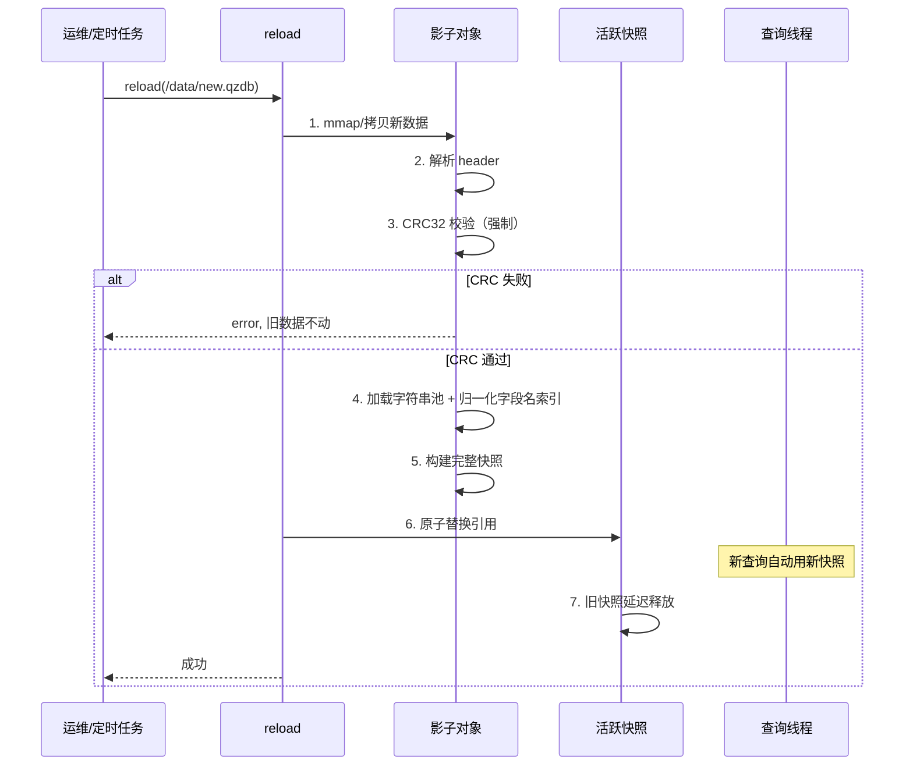

# QZDB Multi-Language SDK API 设计规范 v2.4

> **状态**: 正式规范（真·全量无损合并版：v2.1 全部细节表格 + v2.3 商业版矩阵扩展，逐条修正 v2.3 审计发现的缺口）
> **范围**: Go / Rust / Java / C# / Python / Node.js / PHP / C 八种语言 SDK
> **对标**: 业界主流 IP 地理库 SDK 的 reader/registry 命名与使用习惯
> **原则**: 全新设计，不兼容旧 API，不保留任何 deprecated 过渡
> **适用前提**: 本 SDK 适配 qzdb 商业数据库矩阵（标准版/专业版/ASN版/旗舰版/至尊版 × 国内版/全球版），无外部历史包袱，允许一次性 breaking change
> **v2.4 修订说明**：v2.3 自称"全量无损合并版"但实际静默删除了 v2.1/R2 中已敲定的批量语义表、并发时序图、跨语言能力矩阵、文件变更矩阵；本版本原样恢复上述内容，同时保留 v2.3 新增的 `ChainedReader`/`openBuffer`/版本自省等能力，并修正其中未收口的设计缺口（详见附录 C 审计记录）。

---

## 目录

- [一、背景与现有 SDK 缺陷审计](#一背景与现有-sdk-缺陷审计)
- [二、使用场景与设计目标](#二使用场景与设计目标)
- [三、架构分层：QzdbReader + Registry + ChainedReader](#三架构分层reader--registry--chainedreader)
- [四、生命周期 API：open / openBuffer / reload / close](#四生命周期-apiopen--openbuffer--reload--close)
- [五、查询方法矩阵与 IP 解析标准](#五查询方法矩阵与-ip-解析标准)
- [六、返回实体 GeoInfo 统一规范与容错匹配](#六返回实体-geoinfo-统一规范与容错匹配)
- [七、"未找到"与"格式错误"语义规范](#七未找到与格式错误语义规范)
- [八、批量查询与流式 API 详细设计](#八批量查询与流式-api-详细设计)
- [九、多库联合与拼接查询 (ChainedReader)](#九多库联合与拼接查询-chainedreader)
- [十、命名规范：包名 / 类名 / 方法名](#十命名规范包名--类名--方法名)
- [十一、并发安全与原子发布机制](#十一并发安全与原子发布机制)
- [十二、跨语言能力矩阵（目标状态，验收用）](#十二跨语言能力矩阵目标状态验收用)
- [十三、实施清单](#十三实施清单)
- [附录 A：各语言完整 API 签名](#附录-a各语言完整-api-签名)
- [附录 B：变更履历](#附录-b变更履历)
- [附录 C：v2.3 → v2.4 审计记录](#附录-cv23--v24-审计记录)

---

## 一、背景与现有 SDK 缺陷审计

### 1.1 现状诊断：Java `IpLocation` 的退化设计

现有仓库中，Go / C# / Python / Rust 四种语言的返回实体均采用 `FieldNames []string` + `Values []string` + `Get(name)` 动态取值模式，字段集合可随数据库版本变化而不需要 SDK 发版。**Java SDK 是唯一"退化"的设计**：其 `IpLocation` 实体仅有裸 `String[] values`，无 `fieldNames`、无 `get(name)`，调用方必须靠下标硬编码取值，字段顺序一旦变动就会线上出错。v2.4 决策：彻底删除 `IpLocation`，全语言统一 `GeoInfo`。

### 1.2 锁与并发历史陷阱

之前 Go 版本的 `Reload` 曾用 `sync.RWMutex` 保护查询路径：若某个封装函数在同一次调用里递归调用了另一个也持锁的私有方法，恰逢此时有写锁在排队，会直接死锁。**决策**：查询路径必须完全无锁，用原子指针替换（`atomic.Pointer[Snapshot]`）实现，全语言比照此思路（见十一）。

### 1.3 与业界主流 IP 地理库 SDK 的能力对比

| 维度 | 业界主流 IP 库 SDK | 旧版 QZDB SDK | v2.4 规范 QZDB SDK |
|---|---|---|---|
| 核心类命名 | `Reader`（核心读取类通用命名） | `QzdbSearcher`（包名类名重复） | **`QzdbReader`**（全语言统一；C 语言用 `qzdb_reader_t`） |
| 单例模式 | 无单例，支持 DI 注入 | 强制 `getInstance()` 静态单例 | **彻底去单例 + Registry 便利层** |
| 复合查询 | 官方 SDK 不内置（需用户自行处理多库） | 不支持 | **`ChainedReader`（Fallback/Merge），方法与单库对等** |
| 批量查询 | 需用户自行循环 | 裸数组/部分支持 | **`findBatch` + 流式 `findStream`/`findIter`** |
| 错误表达 | 区分未找到与格式异常 | 部分语言吞异常 | **`BatchResult` 保留三态精度** |
| 热更新 | 需重新创建 `Reader` | 手写 `load()` 易引发 Race | **原子发布无锁 `reload()`/`reloadBuffer()`** |

> 注：业界主流方案一栏为公开文档层面的一般性观察，非逐 SDK 逐版本核实，如用于对外宣传材料请自行复核。

---

## 二、使用场景与设计目标

### 2.1 五种核心使用场景

| 场景 | 特征 | 对 SDK 的要求 | 对应 API |
|---|---|---|---|
| **在线服务嵌入**（风控、网关、CDN） | 高 QPS、长驻进程、P99 极低延迟 | 查询路径**零分配、无锁**；**热更新**不重启 | `find()` 单条查询 |
| **云原生/Serverless**（Lambda、容器） | 数据库从对象存储/内存加载，无本地文件 | **内存 Buffer 加载** | `openBuffer(bytes)` |
| **离线中等批处理**（几千~几十万条） | 一次性内存可承受 | **批量 API** | `findBatch()` |
| **离线大规模 ETL**（百万~数十亿条） | 不能一次性全装进内存 | **流式 API** | `findStream()` / `find_iter()` |
| **多库混合检索**（国内高精+全球ASN） | 跨文件组合路由/字段拼接 | **联合查询 API**，方法矩阵与单库对等 | `ChainedReader` |

### 2.2 设计原则

| 原则 | 说明 |
|---|---|
| **跨语言一致性** | 8 种语言的 API 语义、方法名、返回类型概念上等价 |
| **语言地道性** | 命名、错误处理、资源管理遵循各语言社区惯例 |
| **业界通行设计** | 类名/方法名/用法遵循业界主流 reader/registry 模式 |
| **零分配查询路径** | 高频查询不触发 GC 压力 |
| **故障安全（Fail-Safe）** | `reload()` 失败不影响旧数据；绝不出现"半新半旧"状态 |
| **无历史包袱** | 全新 API，不保留 deprecated 别名 |
| **输入与字段匹配容错** | 见 6.1 精确定义的归一化算法；自动剥离 IPv4-mapped IPv6 前缀，且覆盖所有输入入口 |
| **错误语义不降级** | "没查到""参数错误""数据库损坏"三态在任何 API（含批量/流式/联合查询）中都不能被压缩 |
| **版本矩阵自适应** | 适配 Std/Pro/ASN/Max/Ult × CN/Global 组合，字段缺失统一空值兜底（数值型只用 null/Option，禁止哨兵 0） |
| **向前兼容数据更新** | 数据库月度更新新增枚举值时，老版本 SDK 不崩溃、不解析失败 |
| **规范与排期解耦** | 本文档只定义"是什么"，不含具体日历排期；排期见项目管理工具，本文档仅在附录列出前置依赖项 |

---

## 三、架构分层：QzdbReader + Registry + ChainedReader

### 3.1 三层架构

```
+--------------------------------------------------+
|  Layer 3: ChainedReader（复合联合层）                |
|  | Chain(cnReader, globalReader).find(ip)         |
|  | 方法矩阵与 QzdbReader 对等：find/findUint/findBytes/  |
|  | findFields/findBatch/findStream 全部支持         |
|  | Fallback（依次查找）与 Merge（字段拼接，见 9.1）    |
+--------------------------------------------------+
|  Layer 2: Registry（便利层，可实例化）                |
|  | register("default", "/data/ip.qzdb")           |
|  | get("default").find("1.1.1.1")                 |
|  | 可注册 QzdbReader，也可注册 ChainedReader             |
+--------------------------------------------------+
|  Layer 1: QzdbReader（核心底层类）                       |
|  | 可实例化，支持本地文件路径与内存 Buffer            |
|  | 内部自保证线程安全，无锁只读                       |
|  | 可被 DI 容器接管                                  |
+--------------------------------------------------+
```

### 3.2 Registry 使用范围警告

> ⚠️ **Registry 本质是一个 `Map<name, QzdbReader|ChainedReader>`，与旧单例的区别在于它可以被独立实例化。**
> - ✅ 适用于：CLI 脚本、Lambda 函数、简单 Web 服务——用**进程级默认 Registry**
> - ❌ 不适用于：单元测试、库代码、需要 DI 的框架项目——直接用 `QzdbReader`/`ChainedReader` 实例，或 `new` 一个**独立的 Registry 实例**

### 3.3 Registry 两种用法

```java
// 用法 1：进程级默认 Registry（CLI/脚本场景）
QzdbRegistry.registerGlobal("default", path);
QzdbRegistry.getGlobal("default").find(ip);

// 用法 2：实例级 Registry（测试/DI 场景，推荐）
var reg = new QzdbRegistry();
reg.register("test-db", testPath);
reg.get("test-db").find(ip);
// 测试结束后 reg 被 GC 回收，不污染其他测试
```

各语言"进程级默认"用独立的静态方法/模块级默认实例表达（命名加 `Global`/`Default` 后缀），与"可实例化"的普通用法在方法名上明确区分。

---

## 四、生命周期 API：open / openBuffer / reload / close

### 4.1 构造与加载 API

| 方法 | 语义 | 调用场景 | 失败行为 |
|---|---|---|---|
| **`open(path)`** / 构造函数 | 首次加载（本地文件 mmap） | 长驻进程 | 文件不存在/校验失败抛异常 |
| **`openBuffer(bytes)`** | 首次加载（内存字节数组） | Lambda、内嵌资源、S3 拉取后的内存数据 | 字节流损坏/校验失败抛异常 |
| **`reload(path)`** | 热替换正在服务的数据文件 | 运维/文件监听 | 旧数据保持不变继续服务 |
| **`reloadBuffer(bytes)`** | 热替换正在服务的数据字节 | 配置中心/对象存储动态刷新 | 旧数据保持不变继续服务 |
| **`close()`** | 释放 mmap/文件句柄/内存引用 | 进程退出/实例销毁 | 幂等 |

> ⚠️ **`openBuffer`/`reloadBuffer` 的缓冲区所有权规则（必须写进各语言实现文档，附录 A 逐语言签名旁需注明）：**
> - **默认语义：QzdbReader 在 `open`/`reload` 调用期间会把传入的 buffer 完整拷贝进内部私有内存**，调用方在方法返回后可以自由修改/释放/复用原 buffer，不影响 QzdbReader。
> - 大文件场景下"整份拷贝"会有一次性内存翻倍开销；如果调用方能保证 buffer 在 QzdbReader 生命周期内只读且不被回收（比如 Go 的 `[]byte` 来自 `embed.FS`，本身就是常驻只读数据），可提供一个显式的**零拷贝变体**（如 `OpenBufferNoCopy`/`open_buffer_borrowed`），文档必须明确标注"调用方负责保证该 buffer 在 QzdbReader 关闭前不被修改或释放，否则行为未定义"。零拷贝变体是可选优化项，默认拷贝语义是安全基线，必须先实现。
> - C 语言尤其要在头文件注释里显式写清楚 `qzdb_open_buffer` 是否拷贝，避免调用方传入栈上局部数组导致悬垂指针。

### 4.2 CRC 校验开关规则

> ⚠️ 所有语言的 `open()`/`openBuffer()` 默认开启 CRC 校验（`verify_crc = true`），且签名必须显式带这个可选参数。`reload()`/`reloadBuffer()` 内部**始终强制执行 CRC 校验，不可关闭**。

| 语言 | 关闭 CRC 的写法（仅 `open` 可关） |
|---|---|
| **Go** | `qzdb.Open(path, qzdb.WithCRCVerification(false))` |
| **Rust** | `QzdbReader::open_with(path, ReaderOptions { verify_crc: false, ..Default::default() })` |
| **Java** | `new QzdbReader.Builder(file).verifyCrc(false).build()` |
| **C#** | `QzdbReader.Open(path, new ReaderOptions { VerifyCrc = false })` |
| **Python** | `qzdb.QzdbReader(path, verify_crc=False)` |
| **Node.js** | `qzdb.open(path, { verifyCrc: false })` |
| **PHP** | `new QzdbReader($path, ['verify_crc' => false])` |
| **C** | `qzdb_open_ex(path, /*verify_crc=*/0, /*group=*/0, &ctx)` |

### 4.3 reload 实现要求与原子发布

**原子发布——"要么完全生效、要么完全不生效"：**
```
1. 构建影子对象（新 mmap/新 buffer 拷贝 / 新 header / 新 pools）
2. CRC 校验（强制，不可跳过）-> 失败则直接中止，旧数据不动
3. 一次性原子替换引用
4. 释放旧资源（延迟释放，等读者退出后再 unmap/回收 buffer）
```

### 4.4 各语言原子发布机制

| 语言 | 推荐机制 | 说明 |
|---|---|---|
| **Go** | `atomic.Pointer[snapshot]` | 查询路径完全无锁，零竞争 |
| **Rust** | `arc_swap::ArcSwap<Inner>` | 查询路径无锁；`Drop` 自动释放 |
| **Java** | `volatile` 字段 + 整体替换不可变快照 | JMM happens-before：先解析完 header 再赋值 `data` |
| **C#** | `volatile` 引用 + `Interlocked.Exchange` | 查询路径无需进锁 |
| **Python** | `self.__dict__` 引用整体替换 | GIL 下天然原子 |
| **Node.js** | 不可变 `state` 对象整体替换 | 新对象先构建完整再赋值 |
| **PHP** | Swoole/RoadRunner 场景同 Node 处理 | 传统 per-request 天然隔离 |
| **C** | `_Atomic(qzdb_reader_t*)` + 引用计数 | RCU 风格 |

### 4.5 元信息与版本自省 API

```
reader.version()         // 数据库版本号（例 "2.0"）
reader.dataMonth()       // 数据期号 "YYYY-MM"
reader.edition()         // 版本档次 "std"|"pro"|"asn"|"max"|"ult"
reader.scope()           // 地域覆盖 "cn"|"global"
                        // ⚠️ 当前 .qzdb 格式未含 scope 字段：8 语言 SDK 与
                        // golden 测试现状一律返回 ""；上表取值为格式迁移完成
                        // 后的目标契约（需走 create-migration 落地，见下方前置依赖）。
reader.buildTime()       // 构建时间戳
reader.fileHash()        // CRC32/MD5
reader.fieldNames()      // 字段名列表
reader.hasField(name)    // 是否包含字段（同 6.1 的归一化规则）
reader.poolCount()       // 字符串池计数
reader.verifyCRC()       // 完整性校验
```

> ⚠️ **前置依赖（非纯 SDK 侧改动）**：`dataMonth()`/`edition()`/`scope()` 假定 qzdb **二进制文件格式本身**在 header 里新增了对应字段。这不是单纯的 SDK 代码改动，需要：
> 1. qzdb 文件格式版本号提升，header 结构增加 `edition`/`scope`/`build_month` 字段；
> 2. 数据库构建工具链（生成 `.qzdb` 的脚本）同步支持写入这几个字段；
> 3. 旧版本 `.qzdb` 文件（未来 header 里没有这几个字段）打开时，这几个 API 应返回空字符串而不是报错，保证向后兼容旧数据文件。
>
> 这条依赖必须排在 8 种语言 SDK 改造**之前**完成，作为独立的前置任务。

---

## 五、查询方法矩阵与 IP 解析标准

### 5.1 四层分级

| 层级 | 方法 | 说明 | 场景 |
|---|---|---|---|
| **L0 标准查询** | `find(ip)` | 单条 IPv4/IPv6 -> 完整 GeoInfo | 业务代码首选 |
| **L1 低级查询** | `lookupRowId(ip)` | 只走 trie -> row_id | 性能极敏感 |
| **L2 字段投影** | `findFields(ip, fields)` | 只解析指定列 | 省 CPU |
| **L3 批量/流式** | `findBatch`/`findStream` | 中等批量/大规模 ETL | 离线处理 |
| **L4 多库联合** | `ChainedReader.find(ip)` | 跨库路由/合并，方法矩阵与 L0-L3 对等 | 国内+全球组合部署 |

### 5.2 单条查询方法清单

| 方法 | 说明 |
|---|---|
| `find(ipStr)` | IPv4/IPv6 字符串 -> 完整 GeoInfo |
| `findUint(ipInt)` | IPv4 uint32 -> 完整 GeoInfo |
| `findBytes(ipBytes)` | IPv6 16 字节 -> 完整 GeoInfo |
| `findFields(ipStr, fields[])` | 字段投影 |
| `findStr(ipStr)` | -> pipe 分隔字符串 |
| `lookupRowId(ipStr)` | -> row_id |
| `lookupRowIdUint(ipInt)` | -> row_id |
| `lookupRowIdBytes(ipBytes)` | -> row_id |
| `lookupIds(rowId)` | -> `RowIds` 具名结构体（禁止裸数组） |

### 5.3 输入类型与 IPv4-mapped IPv6 自动降级——覆盖所有入口

所有语言必须支持：字符串（IPv4/IPv6 自动识别）、预解析整数（`findUint`）、16 字节数组（`findBytes`）、语言原生 IP 类型重载（Go `netip.Addr`、Rust `IpAddr`、Java `InetAddress`、C# `IPAddress`、Python `ipaddress.IPv4Address/IPv6Address`）。

> ⚠️ **IPv4-mapped IPv6 自动降级标准（v2.4 修正：覆盖全部入口，不只是字符串）**
>
> 当输入表示的地址是 IPv4-mapped IPv6（如字符串 `::ffff:1.12.0.0`，或 `findBytes` 传入的 16 字节里前 10 字节为 0、接着 2 字节为 `0xFFFF`）时，SDK 内部**在所有入口（`find`/`findAddr`/`findBytes`）统一走同一个"地址规范化"函数**，自动剥离映射前缀、提取出 IPv4 地址，降级走 IPv4 Trie 检索。规范化逻辑只写一份，`find`/`findBytes`/`findAddr` 都调用它，禁止每个入口各自实现一遍（避免出现"字符串输入能自动降级、字节输入不能"这种不一致）。
>
> 降级后如果当前加载的数据库**不包含 IPv4 数据**（纯 IPv6 版本），按"没查到"处理（`NotFound`），不抛异常。
>
> 传统的 IPv4-compatible IPv6（`::1.2.3.4`，已被 RFC 弃用的旧形式）**不做**自动降级，按普通 IPv6 地址走——只对目前实际会遇到的 IPv4-mapped 形式做特殊处理，避免过度设计。

---

## 六、返回实体 GeoInfo 统一规范与容错匹配

### 6.1 动态字段 Getter 的不敏感匹配规则（精确定义）

> ⚠️ **归一化算法（必须 8 种语言逐字节一致，需要一份跨语言一致性测试用例）**：
> ```
> normalize(key) = lowercase(key) 中所有 '_' 字符全部删除
> ```
> 例：`"country_en"` / `"countryEn"` / `"COUNTRY_EN"` / `"Country__En"` 归一化后都得到 `"countryen"`，视为同一个字段。
>
> **适用范围**：`get(name)`、`hasField(name)`、`findFields(ip, fields[])` 的字段名参数**全部**适用同一条归一化规则，三者行为必须一致——不允许 `get()` 模糊匹配而 `findFields()` 精确匹配这种不对称。
>
> **实现要求（避免重演历史上的热路径开销问题）**：归一化查找**必须在 QzdbReader/GeoInfo 构建时（加载 header 阶段）预先构建一次"归一化字段名 → 下标"的哈希表**，`get()`/`hasField()`/`findFields()` 调用时只做一次 O(1) 哈希查找，**不允许每次查询现场对字段名做归一化+线性扫描**。这一条是性能强制项，不是建议项。

### 6.2 toJson() 序列化键名与数字类型规则

1. **JSON Key 格式**：`toJson()` 必须保持底层数据库原始的 `snake_case` 键名（如 `"country_en"`），严禁自动转驼峰。
2. **数字类型**：`longitude`/`latitude`/`asn`/`geo_id` 等数值字段在 `toJson()` 输出中必须为 JSON 数字类型（不带引号），字段为空时输出 `null`。
3. **实现禁忌（Java 尤其注意）**：`toJson()` **不能**通过反射式序列化框架（如 Jackson 的 `ObjectMapper.writeValueAsString(this)`）直接把 Java 对象的 getter 方法名（`getCountryEn()` → 会被序列化成 `countryEn`）当作 JSON key 来源，那样会破坏第 1 条的 `snake_case` 要求。`toJson()` 必须独立实现：直接遍历内部的 `FieldNames`/`Values` 原始数组来拼装 JSON，不依赖任何基于类反射的通用序列化器。

### 6.3 语义 Getter 全集与空值标准（Ult 25 字段）

> ⚠️ **v2.4 修正**：数值字段（`geo_id`/`asn`）的空值兜底统一为 `null`/`None`/`nil`/`Option::None`，**不允许用哨兵值 `0`**（与附录 A 的实际类型签名保持一致；`0` 是合法业务值的可能性虽低但不能排除，用可空类型才是唯一安全的表达）。

| 分类 | 字段名 | 语义 Getter | 空值兜底 |
|---|---|---|---|
| **网段** | `cidr` | `cidr()` | `""` |
| **行政区划** | `country` / `country_en` | `country()` / `countryEn()` | `""` |
| | `province` / `province_en` | `province()` / `provinceEn()` | `""` |
| | `city` / `city_en` | `city()` / `cityEn()` | `""` |
| | `district` | `district()` | `""` |
| | `geo_id` | `geoId()` | `null`/`None`/`nil` |
| **地理扩展** | `longitude` / `latitude` | `longitude()` / `latitude()` | `null`/`None`/`nil` |
| | `timezone` | `timezone()` | `""` |
| **运营商/ASN** | `isp` / `isp_en` | `isp()` / `ispEn()` | `""` |
| | `asn` | `asn()` | `null`/`None`/`nil` |
| | `as_name` / `as_domain` | `asName()` / `asDomain()` | `""` |
| **网络场景** | `usage_type` | `usageType()` | `UsageType.Unknown`（见 6.4，全语言必须是类型化值，不是裸字符串） |
| **地理大区** | `continent` / `continent_en` | `continent()` / `continentEn()` | `""` |
| | `country_code` | `countryCode()` | `""` |
| **跨境/合规** | `country_code`（二字码；`countryAlpha2()` 已重定向读取此字段，修复历史误读 `country_alpha2` 死字段恒 `""`） / `country_alpha3` | `countryAlpha2()` / `countryAlpha3()` | `""` |
| | `currency_code` / `currency_name` | `currencyCode()` / `currencyName()` | `""` |
| | `phone_prefix` | `phonePrefix()` | `""` |
| | `emoji_flag` | `emojiFlag()` | `""` |
| | `languages` | `languages()` | `""` |

### 6.4 UsageType 强类型枚举——21 个官方场景全量定义与多语言映射

**官方 21 个场景枚举全表**：

| `usage_type` 编码 | 中文显示 (`display_zh`) | 英文显示 (`display_en`) | 描述说明 (`description`) |
|---|---|---|---|
| `AICrawler` | AI 爬虫 | AICrawler | AI 训练 / AI 搜索爬虫（GPTBot、ClaudeBot 等） |
| `Backbone` | 骨干网 | Backbone | 运营商骨干传输网 / 国际出口 |
| `Broadband` | 宽带 | Broadband | 家庭/企业宽带接入（xDSL、光纤、Cable、拨号等） |
| `Business` | 企业 | Business | 企业专线 / 企业组网 |
| `CDN` | CDN | CDN | 内容分发网络 |
| `Cloud` | 云服务 | Cloud | 公有云 / 托管云（AWS、阿里云、Azure 等） |
| `DNS` | DNS | DNS | DNS 基础设施 / Anycast DNS |
| `DataCenter` | 数据中心 | DataCenter | IDC / 机房托管 |
| `Education` | 教育网 | Education | 高校 / 科研网（CERNET 等） |
| `Finance` | 金融 | Finance | 银行 / 证券 / 保险等金融机构 |
| `Government` | 政府 | Government | 政务 / 公共机构网络 |
| `ISP` | 互联网提供商 | ISP | 未细分类型的通用 ISP 接入 |
| `IXP` | 交换中心 | IXP | 互联网交换中心 |
| `IoT` | 物联网 | IoT | 物联网设备接入网络 |
| `Mobile` | 移动网络 | Mobile | 蜂窝移动网络（2G/3G/4G/5G） |
| `Reserved` | 保留地址 | Reserved | 保留 / 未分配地址 |
| `Satellite` | 卫星互联网 | Satellite | 卫星 / 低轨星座接入（Starlink 等） |
| `Spider` | 爬虫 | Spider | 通用搜索引擎 / 通用网络爬虫 |
| `Streaming` | 流媒体 | Streaming | 音视频 / 直播流媒体平台 |
| `Unknown` | 未知 | Unknown | 无法判定用途 |
| `VPN` | VPN/代理 | VPN | VPN / 代理 / 隐私网络出口 |

**核心要求**：
1. 8 种语言 SDK 均须预定义上述 21 个场景常量/枚举成员。
2. 无论已知值还是未来数据库更新增加的新类型，SDK 均**不得崩溃**。未知类型自动退化为 `Unknown(rawValue)` 兜底变体。
3. `UsageType` 对象在各语言中需提供 `displayZh()` / `displayEn()` / `description()` 辅助 Getter/方法，方便 UI 展示。

**各语言表达与辅助方法实现方案：**

| 语言 | 实现结构 | 多语言 Getter / 辅助映射 |
|---|---|---|
| **Go** | `type UsageType string` + 常量表 | `func (u UsageType) DisplayZh() string`<br>`func (u UsageType) DisplayEn() string`<br>`func (u UsageType) Description() string` |
| **Rust** | `enum UsageType { AICrawler, Backbone, ..., Unknown(String) }` | `impl UsageType { pub fn display_zh(&self) -> &str ... }` |
| **Java** | `sealed interface UsageType` (含 `KnownUsageType` enum & `UnknownUsageType` record) | `String getDisplayZh()`, `String getDisplayEn()`, `String getDescription()` |
| **C#** | `readonly struct UsageType` | `public string DisplayZh { get; }`, `public string DisplayEn { get; }` |
| **Python** | `class UsageType(str, Enum)` | `@property def display_zh(self) -> str ...` |
| **Node.js** | `UsageType` 常量对象 + 辅助工具类 | `qzdb.UsageType.displayZh(raw)` |
| **PHP** | `final class UsageType` | `public function getDisplayZh(): string` |
| **C** | 字符串 + 查表函数 | `const char* qzdb_usage_type_display_zh(const char* raw)` |

### 6.5 统一类名（删除 IpLocation）

全语言统一使用 `GeoInfo`，Java `IpLocation` 彻底删除。

---

## 七、"未找到"与"格式错误"语义规范

### 7.1 单条查询

| 语言 | "没查到" | "参数/文件错误" |
|---|---|---|
| **Go** | `(nil, ErrNotFound)` | `(nil, ErrCorrupted)` 等 |
| **Rust** | `Ok(None)` | `Err(QzdbError::*)` |
| **Java** | `Optional<GeoInfo>` 返回 `empty()` | 抛 `QzdbException`（非受检） |
| **C#** | `TryFind(ip, out info): bool` + `Find(ip)` 抛异常 | 抛 `QzdbException` |
| **Python** | 返回 `None` | `raise QzdbError(...)` |
| **PHP** | 返回 `null` | `throw QzdbException` |
| **Node.js** | 返回 `null` | `throw QzdbError(...)` |
| **C** | 返回 `QZDB_ERR_NOT_FOUND` | 返回 `QZDB_ERR_*` |

### 7.2 批量查询——逐条结果，不丢失错误语义（v2.4 恢复此前被删内容）

单条 `find()` 区分三种状态：**找到 / 没找到 / 输入格式错误**。批量 API 必须**逐条保留**这三种状态，不能一个 error 覆盖整批，也不能把 error 吞掉当 null。三种状态的判断规则见第八章 8.2 表。

---

## 八、批量查询与流式 API 详细设计

### 8.1 核心问题

同 7.2：批量 API 是"单条查询语义的逐条重复"，不是"单条查询语义的简化/降级"。

### 8.2 逐条结果结构 `BatchResult`（v2.4 恢复完整判断规则表）

| 语言 | 类型定义 | 三种状态表达 |
|---|---|---|
| **Go** | `type BatchResult struct { Info *GeoInfo; Err error }` | `Info!=nil`: 找到；`Info==nil && Err==ErrNotFound`: 没找到；`Err!=nil`（其他）: 输入错误 |
| **Rust** | `Result<Option<GeoInfo>, QzdbError>`（不单独定义 struct，符合 Rust 惯用法） | `Ok(Some)`: 找到；`Ok(None)`: 没找到；`Err`: 输入错误 |
| **Java** | `record BatchResult(String input, Optional<GeoInfo> result, QzdbException error)` | `result.isPresent()`: 找到；`result.isEmpty() && error==null`: 没找到；`error!=null`: 输入错误 |
| **C#** | `struct BatchResult { GeoInfo? Info; QzdbException? Error; }` | `Info!=null`: 找到；两者皆 null: 没找到；`Error!=null`: 输入错误 |
| **Python** | `@dataclass class BatchResult: info: GeoInfo\|None; error: QzdbError\|None` | `info` 非 None: 找到；两者皆 None: 没找到；`error` 非 None: 输入错误 |
| **Node.js** | `{ info: GeoInfo\|null, error: QzdbError\|null }` | 同 Python |
| **PHP** | `class BatchResult { public ?GeoInfo $info; public ?QzdbException $error; }` | 同上 |
| **C** | `struct qzdb_batch_result_t { qzdb_geo_info_t info; int error_code; }` | `error_code==0 && has_data`: 找到；`error_code==QZDB_ERR_NOT_FOUND`: 没找到；其他: 错误 |

### 8.3 `findBatch` — 中等规模批量

```
findBatch(ips[])               -> BatchResult[]
findBatchFields(ips[], fields) -> BatchResult[]
```
**行为规约**：输入输出数组等长一一对应；**顺序执行**，SDK 内部不起线程池；一条格式错误不影响其他条目；建议规模几千到几十万条。

> ⚠️ **Node.js 特别注意（v2.4 恢复此前被删内容）**：`findBatch` 是同步 API，大批量（超过 1 万条）会阻塞事件循环。
> - ≤1 万条：直接调用 `findBatch`
> - \>1 万条：用 `worker_threads` 自行分片，或用 `findIter`
> - 文档和 JSDoc 中必须标注此限制

### 8.4 `findStream` / `findIter` — 大规模流式（数十亿级）

| 语言 | 方法签名 | 说明 |
|---|---|---|
| **Go** | `FindEach(ips []string, fn func(index int, result BatchResult))` | 回调风格 |
| **Rust** | `find_iter<'a>(&'a self, ips: &'a [&str]) -> impl Iterator<Item=Result<Option<GeoInfo>, QzdbError>> + 'a` | 标准迭代器 |
| **Java** | `Stream<BatchResult> findStream(Stream<String> ips)` | Stream 惰性求值 |
| **C#** | `IEnumerable<BatchResult> FindStream(IEnumerable<string> ips)` | `yield return` |
| **Python** | `def find_iter(self, ips) -> Iterator[BatchResult]` | 生成器 |
| **Node.js** | `*findIter(ips)` | Generator，每次 `yield` 让出控制权 |
| **PHP** | `function findIter(array $ips): \Generator` | Generator |
| **C** | `qzdb_find_each(ctx, ips, count, callback, user_data)` | 回调风格 |

**行为规约**：每条 yield/回调一次，不累积结果，内存占用恒定；同样顺序执行，不在 SDK 内部起线程。

---

## 九、多库联合与拼接查询 (ChainedReader)

### 9.1 两种模式，及 v2.4 补齐的规则细节

**Fallback 模式**：
- 按注册顺序依次尝试；前一个库返回"没查到"或"IP 版本在该库不受支持"（如向纯 IPv4 库查询 IPv6 地址）都视为**没查到**，继续尝试下一个库。
- 前一个库返回"输入格式错误"（IP 字符串本身不合法）**立即终止整条 Chain 并直接返回该错误**——格式错误是输入层面的问题，与具体查哪个库无关，重复对每个库都尝试一遍是无意义的浪费。
- 所有库都没查到 -> 整条 Chain 返回"没查到"。

**Merge 模式**：
- 按注册顺序依次查询**所有**库（不像 Fallback 提前短路），把各库返回的字段合并进一个 `GeoInfo`。
- **冲突解决规则（v2.4 新增，此前完全没定义）**：默认策略是 **"先注册者优先"**——某个字段名如果先注册的库已经给出非空值，后面库里同名字段的值不会覆盖它；只有先注册的库里该字段缺失/为空时，才用后面库的值补上。这个默认策略符合"先加国内精华版打底、再拿全球旗舰版补充国内库没有的字段（如 ASN）"这种最典型的使用直觉。
- 如果业务需要相反的"后注册者覆盖"语义，提供一个显式的次要 API `chainMergeOverride(...)`，不作为默认行为。
- 合并后的 `GeoInfo.fieldNames()` 是所有参与库字段名的**去重并集**，顺序为：先注册库的字段在前，后注册库独有的新字段依次追加在后，保证 `toJson()`/`toMap()` 输出顺序在同一组 Chain 配置下是确定性的。

### 9.2 方法矩阵与 QzdbReader 对等（v2.4 修正：不再只有 find）

`ChainedReader` 必须实现与单库 `QzdbReader` **对等的方法全集**（下方为规范要求的必选清单，CI 逐项校验）：

**查询方法（必选）**：
- `find(ip)` / `findUint(ipUint)` / `findBytes(ip16)` / `findFields(ip, fields)`
- `findBatch(ips)` / `findBatchFields(ips, fields)` / `findStream(ips)`（或语言等价名 `findIter` / `FindEach`）

**元信息聚合（必选，见 9.3）**：
- `editions()` / `scopes()` / `dataMonths()` / `readers()`

**不要求**：`lookupRowId` / `lookupIds` 直接绑定单个物理库的内部行号体系，联合场景语义不清晰，`ChainedReader` **不要求**实现；调用方如需底层行号级别操作应直接对某个具体 `QzdbReader` 调用。

> **冲突解决 / 模式细节**见 9.1；**生命周期（不拥有成员库）**见 9.4。

### 9.3 ChainedReader 元信息聚合标准（v2.4 新增，此前目录承诺但正文缺失）

`ChainedReader` 本身不代表单一版本/单一数据期号，元信息 API 采用聚合语义：
```
chainedReader.editions()    // -> 数组，每个成员库各自的 edition，按注册顺序
chainedReader.scopes()      // -> 数组，每个成员库各自的 scope
chainedReader.dataMonths()  // -> 数组，每个成员库各自的 dataMonth
chainedReader.readers()     // -> 返回内部持有的各个 QzdbReader 实例（只读访问，供需要精细控制的调用方绕过 ChainedReader 直接操作某个具体库）
```
不提供单一的 `version()`/`edition()`（返回哪个库的值语义不清晰，容易被误用）。

### 9.4 生命周期（v2.4 新增，此前完全缺失）

`ChainedReader` 自身**不拥有**传入的 `QzdbReader` 实例的生命周期——`ChainedReader.close()`（如果提供）只释放 `ChainedReader` 自身持有的少量聚合状态，**不会**关闭内部持有的各个 `QzdbReader`。各个 `QzdbReader` 的 `open`/`reload`/`close` 由调用方独立管理；`QzdbReader` 发生 `reload()` 后，因为 `ChainedReader` 内部只是持有 `QzdbReader` 的引用而非拷贝快照，之后经过 `ChainedReader` 的查询会自动读到该 `QzdbReader` 重载后的最新数据，无需对 `ChainedReader` 做任何额外操作。这一条必须在文档里明确写出来，避免调用方误以为需要重建 `ChainedReader` 才能感知到成员库的热更新。

### 9.5 典型用法

```java
QzdbReader cnReader = new QzdbReader.Builder(new File("ip_cn_pro.qzdb")).build();
QzdbReader globalReader = new QzdbReader.Builder(new File("ip_global_asn.qzdb")).build();
ChainedReader compositeReader = ChainedReader.chainMerge(cnReader, globalReader);
Optional<GeoInfo> info = compositeReader.find("1.12.0.0");
```

---

## 十、命名规范：包名 / 类名 / 方法名

### 10.1 核心类命名

> 所有语言核心类统一叫 `QzdbReader`（仅 C 语言因无 class，用等价的 `qzdb_reader_t` 结构体）；旧版 `QzdbSearcher` 直接删除。

| 语言 | 包/命名空间 | 核心类名 | 打开 | 查询 | 关闭 |
|---|---|---|---|---|---|
| **Go** | `qzdb` | `QzdbReader` | `qzdb.Open(path)` | `.Find(ip)` | `.Close()` |
| **Rust** | `qzdb` crate | `QzdbReader` | `QzdbReader::open(path)` | `.find(ip)` | `Drop` 自动 |
| **Java** | `com.qqzeng.qzdb` | `QzdbReader` | `new QzdbReader.Builder(file).build()` | `.find(ip)` -> `Optional<GeoInfo>` | `AutoCloseable` |
| **C#** | `Qzdb` | `QzdbReader` | `QzdbReader.Open(path)` | `.Find(ip)` / `.TryFind(ip, out)` | `IDisposable` |
| **Python** | `qzdb` | `QzdbReader` | `qzdb.QzdbReader(path)`，支持 `with` | `.find(ip)` | `__exit__` + `.close()` |
| **Node.js** | `qzdb` | `QzdbReader` | `qzdb.open(path)` | `.find(ip)` | `.close()` |
| **PHP** | `Qzdb` | `QzdbReader` | `new QzdbReader($path)` | `->find($ip)` | `->close()` |
| **C** | — | `qzdb_reader_t` | `qzdb_open(path, &ctx)` | `qzdb_find(ctx, ip, &out)` | `qzdb_close(ctx)` |

### 10.2 方法命名对照表

| 概念 | Go | Rust | Java | C# | Python | Node | PHP | C |
|---|---|---|---|---|---|---|---|---|
| 查询 | `Find` | `find` | `find` | `Find` | `find` | `find` | `find` | `qzdb_find` |
| 批量 | `FindBatch` | `find_batch` | `findBatch` | `FindBatch` | `find_batch` | `findBatch` | `findBatch` | `qzdb_find_batch` |
| 流式 | `FindEach` | `find_iter` | `findStream` | `FindStream` | `find_iter` | `findIter` | `findIter` | `qzdb_find_each` |
| 联合查询 | `Chain`/`ChainMerge` | `chain`/`chain_merge` | `chain`/`chainMerge` | `Chain`/`ChainMerge` | `chain`/`chain_merge` | `chain`/`chainMerge` | `chain`/`chainMerge` | `qzdb_chain_new` |
| 热更新 | `Reload` | `reload` | `reload` | `Reload` | `reload` | `reload` | `reload` | `qzdb_reload` |
| 版本档次 | `Edition` | `edition` | `getEdition` | `Edition` | `edition` | `edition` | `getEdition` | `qzdb_edition` |
| 地域范围 | `Scope` | `scope` | `getScope` | `Scope` | `scope` | `scope` | `getScope` | `qzdb_scope` |

---

## 十一、并发安全与原子发布机制

### 11.1 查询路径线程安全

同 4.4 表——各语言的原子发布机制在此章节复用，不重复列出。

> **实现禁忌**：查询路径**不允许**用会阻塞写者的传统读写锁去保护每一次查询；也**不允许**在同一 goroutine/线程内对同一把读写锁做递归加锁（Go `sync.RWMutex` 递归 `RLock` 在有写者等待时会死锁）——每个真正触碰共享状态的方法独立获取一次锁/原子引用，纯转发方法不得重复加锁。

### 11.2 reload 安全流程（v2.4 恢复此前被删的时序图）



### 11.3 批量/流式 API 的并发模型

> ⚠️ `findBatch` 和 `findStream`/`findIter` 都是顺序执行，SDK 内部不起线程池。理由：①跨语言行为一致性；②并行粒度交给调用方控制；③trie 查询是纯 CPU 密集操作，线程池在 GIL 语言（Python）里反而更慢。需要并行的调用方自行分片，多线程/多协程里分别调用单条 `find()`（Go goroutine+channel，Java `parallelStream()`，Rust `rayon::par_iter()`，C# `Parallel.ForEach`，Node.js `worker_threads`）。

---

## 十二、跨语言能力矩阵（目标状态，验收用）

> v2.4 恢复此前被删的逐语言验收表，供 QA / Code Review 逐项打钩使用。

### 12.1 GeoInfo 实体能力

| 能力 | Go | Rust | Java | C# | Python | Node | PHP | C |
|---|:---:|:---:|:---:|:---:|:---:|:---:|:---:|:---:|
| `fieldNames` | ✅ | ✅ | ✅ | ✅ | ✅ | ✅ | ✅ | ✅ |
| `get(name)`（归一化匹配） | ✅ | ✅ | ✅ | ✅ | ✅ | ✅ | ✅ | — |
| `toPipe()` | ✅ | ✅ | ✅ | ✅ | ✅ | ✅ | ✅ | — |
| `toMap()`（String→String） | ✅ | ✅ | ✅ | ✅ | ✅ | ✅ | ✅ | — |
| `toJson()`（snake_case + 数值类型保留） | ✅ | ✅ | ✅ | ✅ | ✅ | ✅ | ✅ | — |
| Ult 25 字段语义化 getter | ✅ | ✅ | ✅ | ✅ | ✅ | ✅ | ✅ | — |
| `UsageType` 类型化（非裸字符串，见 6.4） | ✅ | ✅ | ✅ | ✅ | ✅ | ✅ | ✅ | — |

### 12.2 查询方法

| 方法 | Go | Rust | Java | C# | Python | Node | PHP | C |
|---|:---:|:---:|:---:|:---:|:---:|:---:|:---:|:---:|
| `find`/`findUint`/`findBytes`/`findFields` | ✅ | ✅ | ✅ | ✅ | ✅ | ✅ | ✅ | ✅ |
| `findBatch`（逐条 `BatchResult`） | ✅ | ✅ | ✅ | ✅ | ✅ | ✅ | ✅ | ✅ |
| `findStream`/`findIter` | ✅ | ✅ | ✅ | ✅ | ✅ | ✅ | ✅ | ✅ |
| `lookupRowId`/`lookupIds`（具名结构体） | ✅ | ✅ | ✅ | ✅ | ✅ | ✅ | ✅ | ✅ |
| 原生 IP 类型重载 | ✅ | ✅ | ✅ | ✅ | ✅ | — | — | — |
| `openBuffer`/`reloadBuffer` | ✅ | ✅ | ✅ | ✅ | ✅ | ✅ | ✅ | ✅ |
| `ChainedReader` 方法矩阵对等（9.2） | ✅ | ✅ | ✅ | ✅ | ✅ | ✅ | ✅ | ✅ |

### 12.3 生命周期与资源管理

| 特性 | Go | Rust | Java | C# | Python | Node | PHP | C |
|---|:---:|:---:|:---:|:---:|:---:|:---:|:---:|:---:|
| `open`/`reload` 分离 | ✅ | ✅ | ✅ | ✅ | ✅ | ✅ | ✅ | ✅ |
| CRC 默认开启+可关闭；reload 强制不可关 | ✅ | ✅ | ✅ | ✅ | ✅ | ✅ | ✅ | ✅ |
| 无强制单例 | ✅ | ✅ | ✅ | ✅ | ✅ | ✅ | ✅ | ✅ |
| Registry（可实例化+进程级默认） | ✅ | ✅ | ✅ | ✅ | ✅ | ✅ | ✅ | ✅ |
| 原子发布 | ✅ | ✅ | ✅ | ✅ | ✅ | ✅ | ✅ | ✅ |
| 资源自动释放 | — | ✅ `Drop` | ✅ `AutoCloseable` | ✅ `IDisposable` | ✅ `with` | — | — | — |

### 12.4 跨语言一致性 CI 清单（v2.4.1 新增，把审查结论回流为硬校验）

下列项纳入 CI，任一语言不符即红灯（源自跨语言一致性审查 `docs/cross_lang_consistency_review_20260807.md`）：

1. **哨兵 0 禁令**：`geo_id`/`asn`/`usage_type` 等数值字段缺失时，解码层必须输出空值 / `""`，禁止 `0`（对应 `API_CONTRACT §8.7`）。
2. **批量三态**：`findBatch`/`findStream` 的 `BatchResult.Error` 必须区分「未命中」与「非法 IP」，不得互相归并。
3. **命名规范**：核心类名 `QzdbReader`、批量结果 `BatchResult`、行号 `RowIds`、链式 `ChainedReader` 与 §10.2 方法命名表逐语言一致（CI lint 比对 8 语言公共方法名集合）。
4. **ChainedReader 矩阵**：§9.2 必选方法全集（查询 7 + 元信息 4）在已实现 `ChainedReader` 中齐备。
5. **Geo 字段黄金零偏差**：对 `golden_vectors.json` 与源 CSV 真值，8 语言输出字段级 0 失配。

---

## 十三、实施清单

> 全部为必须项，一次性到位，无过渡期。具体日历排期不属于本规范范畴，见项目管理工具；本节只列出内容依赖关系。

### 13.1 前置依赖（阻塞项，必须先完成）

1. qzdb **二进制文件格式**升级：header 增加 `edition`/`scope`/`build_month` 字段（见 4.5 说明），旧文件缺失时 SDK 端读出空字符串兼容。
2. 数据库构建工具链同步支持写入上述新 header 字段。

### 13.2 删除项（Breaking Changes）

| 删除内容 | 涉及语言 |
|---|---|
| 删除 `IpLocation.java` | Java |
| 删除所有 `QzdbSearcher` 类名 | 全语言 |
| 删除所有 `getInstance()`/单例代码 | 全语言 |
| 删除 `load()` 方法 | Java/Python/C#/Node/PHP |
| 删除 Rust `OnceLock<QzdbSearcher>` | Rust |

### 13.3 新增与重构项

| 新增内容 | 涉及语言 |
|---|---|
| `QzdbReader`（含 `openBuffer`/`reloadBuffer`，明确缓冲区拷贝语义） | 全语言 |
| `Registry`（可实例化+进程级默认） | 全语言 |
| `GeoInfo`（归一化 `get`/`hasField`，Ult 25 字段 getter，`UsageType` 类型化） | 全语言 |
| `BatchResult` 逐条结果结构 | 全语言 |
| `findBatch`/`findBatchFields`/`findStream`/`findIter` | 全语言 |
| `RowIds` 具名结构体 | 全语言 |
| `ChainedReader`（Fallback/Merge，方法矩阵对等，冲突解决规则，元信息聚合） | 全语言 |
| `UsageType` 按 6.4 各语言方案实现 | 全语言 |
| `edition()`/`scope()`/`dataMonth()`/`hasField()` 元信息 API | 全语言 |
| 归一化字段索引在加载期一次性构建（而非查询期现算） | 全语言 |

### 13.4 文件变更矩阵（v2.4 恢复此前被删内容）

| 语言 | 删除 | 新增 | 重命名/重构 |
|---|---|---|---|
| **Go** | — | `registry.go`, `batch.go`, `chain.go` | `qzdb.go`（`QzdbReader`+`GeoInfo`补方法） |
| **Rust** | — | `registry.rs`, `batch.rs`, `chain.rs` | `lib.rs`（`QzdbReader`+`GeoInfo`补方法） |
| **Java** | `IpLocation.java`, `DatabaseReader.java` | `GeoInfo.java`, `QzdbReader.java`, `QzdbRegistry.java`, `BatchResult.java`, `RowIds.java`, `UsageType.java`, `KnownUsageType.java`, `UnknownUsageType.java`, `ChainedReader.java` | — |
| **C#** | `DatabaseReader.cs` | `QzdbReader.cs`, `QzdbRegistry.cs`, `BatchResult.cs`, `ReaderOptions.cs`, `RowIds.cs`, `UsageType.cs`, `ChainedReader.cs` | — |
| **Python** | — | `usage_type.py`, `chained_reader.py` | `qzdb.py`（`QzdbReader`+`Registry`+`BatchResult`+流式） |
| **Node.js** | — | `usage-type.js`, `chained-reader.js` | `qzdb.js`（`QzdbReader`+`Registry`+`BatchResult`+Generator） |
| **PHP** | `QzdbSearcher.php` | `QzdbReader.php`, `Registry.php`, `BatchResult.php`, `RowIds.php`, `UsageType.php`, `ChainedReader.php` | — |
| **C** | `qzdb_searcher.c/h` | `qzdb_reader.c/h`, `qzdb_registry.c/h`, `qzdb_chain.c/h` | — |

### 13.5 排期建议（信息性提示，非规范正文）

> 8 种语言的并发模型重写 + `ChainedReader`/`openBuffer` 等全新子系统，加上**跨语言一致性验证**（不是每个语言各自测通过就算数，而是同一批测试用例在 8 种语言里跑出完全一致的结果），工作量明显大于单纯的"逐语言功能补齐"。排期时请单独给"跨语言一致性测试"留出与"各语言开发"同量级的时间，不要把它压缩进最后几天的"全语言单测+性能 Benchmark"里一起做。具体日期请在项目管理工具中单独制定甘特图，不建议写入本规范文档（规范需要长期作为基线引用，带日历日期的进度计划会让文档显得"过期"）。

---

## 附录 A：各语言完整 API 签名

### A.1 Go

```go
package qzdb

type QzdbReader struct { /* ... */ }

// 加载 API（openBuffer 默认拷贝传入的 data，不持有调用方原切片；见 4.1 缓冲区所有权说明）
func Open(path string, opts ...Option) (*QzdbReader, error)
func OpenBuffer(data []byte, opts ...Option) (*QzdbReader, error)
func OpenBufferNoCopy(data []byte, opts ...Option) (*QzdbReader, error) // 零拷贝变体，调用方须保证 data 生命周期内只读不释放

type Option func(*readerConfig)
func WithGroupIndex(idx int) Option
func WithCRCVerification(enabled bool) Option // 默认 true

// 单条查询
func (r *QzdbReader) Find(ipStr string) (*GeoInfo, error)
func (r *QzdbReader) FindAddr(addr netip.Addr) (*GeoInfo, error)
func (r *QzdbReader) FindUint(ipInt uint32) (*GeoInfo, error)
func (r *QzdbReader) FindBytes(ip16 [16]byte) (*GeoInfo, error)
func (r *QzdbReader) FindFields(ipStr string, fields []string) (*GeoInfo, error)
func (r *QzdbReader) FindStr(ipStr string) (string, error)

// 批量与流式
type BatchResult struct {
    Info *GeoInfo
    Err  error
}
func (r *QzdbReader) FindBatch(ips []string) []BatchResult
func (r *QzdbReader) FindBatchFields(ips []string, fields []string) []BatchResult
func (r *QzdbReader) FindEach(ips []string, fn func(index int, result BatchResult))

// 低级查询
func (r *QzdbReader) LookupRowId(ipStr string) uint32
func (r *QzdbReader) LookupRowIdUint(ipInt uint32) uint32
func (r *QzdbReader) LookupRowIdBytes(ip16 [16]byte) uint32
func (r *QzdbReader) LookupIds(rowId uint32) (geo, asn, usage uint32, ok bool)

// 生命周期
func (r *QzdbReader) Reload(path string) error
func (r *QzdbReader) ReloadBuffer(data []byte) error
func (r *QzdbReader) Close() error

// 元信息与自省
func (r *QzdbReader) Version() string
func (r *QzdbReader) DataMonth() string
func (r *QzdbReader) Edition() string
func (r *QzdbReader) Scope() string
func (r *QzdbReader) BuildTime() string
func (r *QzdbReader) FileHash() string
func (r *QzdbReader) FieldNames() []string
func (r *QzdbReader) HasField(name string) bool // 归一化匹配，见 6.1
func (r *QzdbReader) VerifyCRC() bool

// UsageType：字符串别名 + 预定义常量，未知值就是原始字符串本身
type UsageType string
const (
    UsageTypeBroadband  UsageType = "Broadband"
    UsageTypeMobile     UsageType = "Mobile"
    UsageTypeBusiness   UsageType = "Business"
    UsageTypeEducation  UsageType = "Education"
    UsageTypeDataCenter UsageType = "DataCenter"
    UsageTypeCloud      UsageType = "Cloud"
    UsageTypeCDN        UsageType = "CDN"
    UsageTypeAnycast    UsageType = "Anycast"
    UsageTypeSatellite  UsageType = "Satellite"
    UsageTypeBackbone   UsageType = "Backbone"
    // ... 其余细分场景常量
)

// GeoInfo（归一化匹配，见 6.1；数值缺失一律 nil，见 6.3）
type GeoInfo struct { /* ... */ }
func (g *GeoInfo) Get(name string) string // 归一化匹配
func (g *GeoInfo) ToPipe() string
func (g *GeoInfo) ToMap() map[string]string
func (g *GeoInfo) ToJSON() ([]byte, error) // snake_case 键名 + 数值类型保留，见 6.2

func (g *GeoInfo) CIDR() string
func (g *GeoInfo) Country() string
func (g *GeoInfo) CountryEn() string
func (g *GeoInfo) Province() string
func (g *GeoInfo) ProvinceEn() string
func (g *GeoInfo) City() string
func (g *GeoInfo) CityEn() string
func (g *GeoInfo) District() string
func (g *GeoInfo) GeoID() *uint32
func (g *GeoInfo) Longitude() *float64
func (g *GeoInfo) Latitude() *float64
func (g *GeoInfo) Timezone() string
func (g *GeoInfo) ISP() string
func (g *GeoInfo) ISPEn() string
func (g *GeoInfo) ASN() *uint32
func (g *GeoInfo) ASName() string
func (g *GeoInfo) ASDomain() string
func (g *GeoInfo) UsageType() UsageType
func (g *GeoInfo) CountryAlpha2() string
func (g *GeoInfo) CountryAlpha3() string
func (g *GeoInfo) CurrencyCode() string
func (g *GeoInfo) CurrencyName() string
func (g *GeoInfo) PhonePrefix() string
func (g *GeoInfo) EmojiFlag() string
func (g *GeoInfo) Languages() string

// ChainedReader（方法矩阵与 QzdbReader 对等，见 9.2）
type ChainedReader struct { /* ... */ }
func Chain(readers ...*QzdbReader) *ChainedReader
func ChainMerge(readers ...*QzdbReader) *ChainedReader
func ChainMergeOverride(readers ...*QzdbReader) *ChainedReader // 后注册者覆盖语义，见 9.1
func (c *ChainedReader) Find(ipStr string) (*GeoInfo, error)
func (c *ChainedReader) FindUint(ipInt uint32) (*GeoInfo, error)
func (c *ChainedReader) FindBytes(ip16 [16]byte) (*GeoInfo, error)
func (c *ChainedReader) FindFields(ipStr string, fields []string) (*GeoInfo, error)
func (c *ChainedReader) FindBatch(ips []string) []BatchResult
func (c *ChainedReader) FindEach(ips []string, fn func(index int, result BatchResult))
func (c *ChainedReader) Editions() []string
func (c *ChainedReader) Scopes() []string
func (c *ChainedReader) DataMonths() []string
func (c *ChainedReader) Readers() []*QzdbReader

// Registry
type Registry struct { /* ... */ }
func NewRegistry() *Registry
func (reg *Registry) Register(name, path string, opts ...Option) error
func (reg *Registry) RegisterBuffer(name string, data []byte, opts ...Option) error
func (reg *Registry) Get(name string) *QzdbReader
func (reg *Registry) Unregister(name string)

func RegisterGlobal(name, path string, opts ...Option) error
func GetGlobal(name string) *QzdbReader
func UnregisterGlobal(name string)
```

### A.2 Rust

```rust
pub struct QzdbReader { /* ... */ }

pub struct ReaderOptions {
    pub verify_crc: bool,
    pub group_index: usize,
}

pub struct RowIds {
    pub geo_id: u32,
    pub asn_id: u32,
    pub usage_id: u32,
}

pub enum UsageType {
    Broadband, Mobile, Business, Education, DataCenter,
    Cloud, CDN, Anycast, Satellite, Backbone,
    // ... 其余细分场景
    Unknown(String), // 携带原始字符串
}

impl QzdbReader {
    pub fn open(path: &str) -> Result<Self, QzdbError>;
    pub fn open_buffer(data: Vec<u8>) -> Result<Self, QzdbError>; // 拷贝语义
    pub fn open_with(path: &str, opts: ReaderOptions) -> Result<Self, QzdbError>;
    pub fn open_buffer_with(data: Vec<u8>, opts: ReaderOptions) -> Result<Self, QzdbError>;

    pub fn find(&self, ip: &str) -> Result<Option<GeoInfo>, QzdbError>;
    pub fn find_addr(&self, ip: IpAddr) -> Result<Option<GeoInfo>, QzdbError>;
    pub fn find_uint(&self, ip: u32) -> Result<Option<GeoInfo>, QzdbError>;
    pub fn find_bytes(&self, ip16: &[u8; 16]) -> Result<Option<GeoInfo>, QzdbError>;
    pub fn find_fields(&self, ip: &str, fields: &[&str]) -> Result<Option<GeoInfo>, QzdbError>;
    pub fn find_str(&self, ip: &str) -> Result<Option<String>, QzdbError>;

    pub fn find_batch(&self, ips: &[&str]) -> Vec<Result<Option<GeoInfo>, QzdbError>>;
    pub fn find_batch_fields(&self, ips: &[&str], fields: &[&str])
        -> Vec<Result<Option<GeoInfo>, QzdbError>>;
    pub fn find_iter<'a>(&'a self, ips: &'a [&str])
        -> impl Iterator<Item = Result<Option<GeoInfo>, QzdbError>> + 'a;

    pub fn lookup_row_id(&self, ip: &str) -> Option<u32>;
    pub fn lookup_ids(&self, row_id: u32) -> Option<RowIds>;

    pub fn reload(&self, path: &str) -> Result<(), QzdbError>;
    pub fn reload_buffer(&self, data: Vec<u8>) -> Result<(), QzdbError>;

    pub fn version(&self) -> &str;
    pub fn data_month(&self) -> &str;
    pub fn edition(&self) -> &str;
    pub fn scope(&self) -> &str;
    pub fn build_time(&self) -> &str;
    pub fn file_hash(&self) -> &str;
    pub fn field_names(&self) -> &[String];
    pub fn has_field(&self, name: &str) -> bool; // 归一化匹配
}

pub struct GeoInfo { /* ... */ }
impl GeoInfo {
    pub fn get(&self, name: &str) -> &str; // 归一化匹配
    pub fn to_pipe(&self) -> String;
    pub fn to_map(&self) -> HashMap<String, String>;
    // to_json 通过手写序列化（不用派生 Serialize 直接暴露内部字段名），保证 snake_case

    pub fn cidr(&self) -> &str;
    pub fn country(&self) -> &str;
    pub fn country_en(&self) -> &str;
    pub fn province(&self) -> &str;
    pub fn province_en(&self) -> &str;
    pub fn city(&self) -> &str;
    pub fn city_en(&self) -> &str;
    pub fn district(&self) -> &str;
    pub fn geo_id(&self) -> Option<u32>;
    pub fn longitude(&self) -> Option<f64>;
    pub fn latitude(&self) -> Option<f64>;
    pub fn timezone(&self) -> &str;
    pub fn isp(&self) -> &str;
    pub fn isp_en(&self) -> &str;
    pub fn asn(&self) -> Option<u32>;
    pub fn as_name(&self) -> &str;
    pub fn as_domain(&self) -> &str;
    pub fn usage_type(&self) -> UsageType;
    pub fn continent(&self) -> &str;
    pub fn continent_en(&self) -> &str;
    pub fn country_code(&self) -> &str;
    pub fn country_alpha2(&self) -> &str;  // 重定向到 country_code
    pub fn country_alpha3(&self) -> &str;
    pub fn currency_code(&self) -> &str;
    pub fn currency_name(&self) -> &str;
    pub fn phone_prefix(&self) -> &str;
    pub fn emoji_flag(&self) -> &str;
    pub fn languages(&self) -> &str;
}

pub struct ChainedReader { /* ... */ }
impl ChainedReader {
    pub fn chain(readers: Vec<Arc<QzdbReader>>) -> Self;
    pub fn chain_merge(readers: Vec<Arc<QzdbReader>>) -> Self;
    pub fn chain_merge_override(readers: Vec<Arc<QzdbReader>>) -> Self;
    pub fn find(&self, ip: &str) -> Result<Option<GeoInfo>, QzdbError>;
    pub fn find_batch(&self, ips: &[&str]) -> Vec<Result<Option<GeoInfo>, QzdbError>>;
    pub fn editions(&self) -> Vec<&str>;
    pub fn scopes(&self) -> Vec<&str>;
    pub fn readers(&self) -> &[Arc<QzdbReader>];
}

pub struct Registry { /* ... */ }
impl Registry {
    pub fn new() -> Self;
    pub fn register(&self, name: &str, path: &str, opts: ReaderOptions) -> Result<(), QzdbError>;
    pub fn register_buffer(&self, name: &str, data: Vec<u8>, opts: ReaderOptions) -> Result<(), QzdbError>;
    pub fn get(&self, name: &str) -> Option<Arc<QzdbReader>>;
    pub fn unregister(&self, name: &str);
}
pub fn global_registry() -> &'static Registry;
```

### A.3 Java

```java
package com.qqzeng.qzdb;

public sealed interface UsageType permits KnownUsageType, UnknownUsageType {
    String rawValue();
}
public enum KnownUsageType implements UsageType {
    BROADBAND, MOBILE, BUSINESS, EDUCATION, DATA_CENTER,
    CLOUD, CDN, ANYCAST, SATELLITE, BACKBONE;
    // ...
    @Override public String rawValue() { /* 映射回原始字符串 */ return null; }
}
public record UnknownUsageType(String rawValue) implements UsageType {}

public class QzdbReader implements AutoCloseable {
    public static class Builder {
        public Builder(File database);
        public Builder(byte[] buffer);       // 拷贝语义，见 4.1
        public Builder(InputStream stream) throws IOException;
        public Builder groupIndex(int idx);
        public Builder verifyCrc(boolean enabled);
        public QzdbReader build() throws QzdbException;
    }

    public Optional<GeoInfo> find(String ipStr);
    public Optional<GeoInfo> find(InetAddress addr);
    public Optional<GeoInfo> findUint(int ipInt);
    public Optional<GeoInfo> findBytes(byte[] ip16);
    public Optional<GeoInfo> findFields(String ipStr, String[] fields);
    public String findStr(String ipStr);

    public record BatchResult(String input, Optional<GeoInfo> result, QzdbException error) {}
    public List<BatchResult> findBatch(List<String> ips);
    public List<BatchResult> findBatchFields(List<String> ips, String[] fields);
    public Stream<BatchResult> findStream(Stream<String> ips);

    public record RowIds(int geoId, int asnId, int usageId) {}
    public int lookupRowId(String ipStr);
    public int lookupRowIdUint(int ipInt);
    public RowIds lookupIds(int rowId);

    public void reload(String path) throws QzdbException;
    public void reloadBuffer(byte[] data) throws QzdbException;
    @Override public void close();

    public String getVersion();
    public String getDataMonth();
    public String getEdition();
    public String getScope();
    public String getBuildTime();
    public String getFileHash();
    public String[] getFieldNames();
    public boolean hasField(String name); // 归一化匹配
    public boolean verifyCrc();
}

public class GeoInfo {
    public String get(String name); // 归一化匹配
    public String toPipeString();
    public Map<String, String> toMap();
    public String toJson(); // 手写序列化，snake_case + 数值类型，见 6.2 实现禁忌

    public String getCidr();
    public String getCountry();
    public String getCountryEn();
    public String getProvince();
    public String getProvinceEn();
    public String getCity();
    public String getCityEn();
    public String getDistrict();
    public Long getGeoId();      // 缺失 null
    public Double getLongitude();
    public Double getLatitude();
    public String getTimezone();
    public String getIsp();
    public String getIspEn();
    public Long getAsn();        // 缺失 null
    public String getAsName();
    public String getAsDomain();
    public UsageType getUsageType();
    public String getContinent();
    public String getContinentEn();
    public String getCountryCode();
    public String getCountryAlpha2();  // 重定向到 country_code
    public String getCountryAlpha3();
    public String getCurrencyCode();
    public String getCurrencyName();
    public String getPhonePrefix();
    public String getEmojiFlag();
    public String getLanguages();
}

public class ChainedReader {
    public static ChainedReader chain(QzdbReader... readers);
    public static ChainedReader chainMerge(QzdbReader... readers);
    public static ChainedReader chainMergeOverride(QzdbReader... readers);
    public Optional<GeoInfo> find(String ipStr);
    public Optional<GeoInfo> findUint(int ipInt);
    public Optional<GeoInfo> findBytes(byte[] ip16);
    public Optional<GeoInfo> findFields(String ipStr, String[] fields);
    public List<BatchResult> findBatch(List<String> ips);
    public String[] editions();
    public String[] scopes();
    public List<QzdbReader> readers();
}

public class QzdbRegistry {
    public QzdbRegistry();
    public void register(String name, String path) throws QzdbException;
    public void registerBuffer(String name, byte[] buffer) throws QzdbException;
    public QzdbReader get(String name);
    public void unregister(String name);

    public static void registerGlobal(String name, String path) throws QzdbException;
    public static QzdbReader getGlobal(String name);
    public static void unregisterGlobal(String name);
}
```

### A.4 C#

```csharp
namespace Qzdb
{
    public class ReaderOptions
    {
        public bool VerifyCrc { get; set; } = true;
        public int GroupIndex { get; set; } = 0;
    }

    public readonly struct UsageType
    {
        public bool IsKnown { get; }
        public KnownUsageType Known { get; }   // 枚举，仅 IsKnown=true 时有效
        public string RawValue { get; }         // 始终有值，未知时携带原始字符串
    }
    public enum KnownUsageType { Broadband, Mobile, Business, Education, DataCenter, Cloud, CDN, Anycast, Satellite, Backbone /* ... */ }

    public sealed class QzdbReader : IDisposable
    {
        public static QzdbReader Open(string path, ReaderOptions options = null);
        public static QzdbReader OpenBuffer(byte[] buffer, ReaderOptions options = null); // 拷贝语义

        public GeoInfo Find(string ipStr);
        public GeoInfo Find(IPAddress addr);
        public bool TryFind(string ipStr, out GeoInfo result);
        public GeoInfo FindUint(uint ipInt);
        public GeoInfo FindBytes(byte[] ip16);
        public GeoInfo FindFields(string ipStr, string[] fields);
        public string FindStr(string ipStr);

        public struct BatchResult { public GeoInfo Info; public QzdbException Error; }
        public BatchResult[] FindBatch(string[] ips);
        public BatchResult[] FindBatchFields(string[] ips, string[] fields);
        public IEnumerable<BatchResult> FindStream(IEnumerable<string> ips);

        public uint LookupRowId(string ipStr);
        public (uint Geo, uint Asn, uint Usage) LookupIds(uint rowId);

        public void Reload(string path);
        public void ReloadBuffer(byte[] buffer);
        public void Dispose();

        public string Version { get; }
        public string DataMonth { get; }
        public string Edition { get; }
        public string Scope { get; }
        public string BuildTime { get; }
        public string FileHash { get; }
        public string[] FieldNames { get; }
        public bool HasField(string name); // 归一化匹配
        public bool VerifyCRC();
    }

    public class GeoInfo
    {
        public string Get(string name); // 归一化匹配
        public string ToPipe();
        public Dictionary<string, string> ToMap();
        public string ToJson(); // 手写序列化，见 6.2

        public string Cidr => Get("cidr");
        public string Country => Get("country");
        public string CountryEn => Get("country_en");
        public string Province => Get("province");
        public string ProvinceEn => Get("province_en");
        public string City => Get("city");
        public string CityEn => Get("city_en");
        public string District => Get("district");
        public uint? GeoId { get; }      // 缺失 null
        public double? Longitude { get; }
        public double? Latitude { get; }
        public string Timezone => Get("timezone");
        public string Isp => Get("isp");
        public string IspEn => Get("isp_en");
        public uint? Asn { get; }        // 缺失 null
        public string AsName => Get("as_name");
        public string AsDomain => Get("as_domain");
        public UsageType UsageType { get; }
        public string Continent => Get("continent");
        public string ContinentEn => Get("continent_en");
        public string CountryCode => Get("country_code");
        public string CountryAlpha2 => Get("country_code"); // 重定向：数据集以 country_code 存 alpha-2，修复历史误读 country_alpha2 死字段
        public string CountryAlpha3 => Get("country_alpha3");
        public string CurrencyCode => Get("currency_code");
        public string CurrencyName => Get("currency_name");
        public string PhonePrefix => Get("phone_prefix");
        public string EmojiFlag => Get("emoji_flag");
        public string Languages => Get("languages");
    }

    public class ChainedReader
    {
        public static ChainedReader Chain(params QzdbReader[] readers);
        public static ChainedReader ChainMerge(params QzdbReader[] readers);
        public static ChainedReader ChainMergeOverride(params QzdbReader[] readers);
        public GeoInfo Find(string ipStr);
        public GeoInfo FindUint(uint ipInt);
        public GeoInfo FindBytes(byte[] ip16);
        public GeoInfo FindFields(string ipStr, string[] fields);
        public BatchResult[] FindBatch(string[] ips);
        public string[] Editions { get; }
        public string[] Scopes { get; }
        public QzdbReader[] Readers { get; }
    }

    public class QzdbRegistry
    {
        public QzdbRegistry();
        public void Register(string name, string path, ReaderOptions opts = null);
        public void RegisterBuffer(string name, byte[] buffer, ReaderOptions opts = null);
        public QzdbReader Get(string name);
        public void Unregister(string name);

        public static QzdbRegistry Default { get; }
    }
}
```

### A.5 Python

```python
import qzdb
from dataclasses import dataclass
from typing import NamedTuple, Iterator, Union
from enum import Enum

class UsageType(str, Enum):
    BROADBAND = "Broadband"
    MOBILE = "Mobile"
    BUSINESS = "Business"
    EDUCATION = "Education"
    DATA_CENTER = "DataCenter"
    CLOUD = "Cloud"
    CDN = "CDN"
    ANYCAST = "Anycast"
    SATELLITE = "Satellite"
    BACKBONE = "Backbone"
    # ...

    @staticmethod
    def from_raw(s: str) -> "UsageType | str":
        """已知值返回枚举成员，未知值直接返回原始字符串。"""
        try:
            return UsageType(s)
        except ValueError:
            return s

class RowIds(NamedTuple):
    geo_id: int
    asn_id: int
    usage_id: int

@dataclass
class BatchResult:
    info: "GeoInfo | None"
    error: "QzdbError | None"

class QzdbReader:
    def __init__(self, path, group_index=0, verify_crc=True): ...
    @staticmethod
    def open_buffer(buffer: bytes, group_index=0, verify_crc=True) -> "QzdbReader": ... # 拷贝语义

    def __enter__(self): ...
    def __exit__(self, *args): ...

    def find(self, ip) -> "GeoInfo | None": ...
    def find_uint(self, ip_int) -> "GeoInfo | None": ...
    def find_bytes(self, ip_bytes) -> "GeoInfo | None": ...
    def find_fields(self, ip, fields) -> "GeoInfo | None": ...
    def find_str(self, ip) -> "str | None": ...

    def find_batch(self, ips) -> list[BatchResult]: ...
    def find_batch_fields(self, ips, fields) -> list[BatchResult]: ...
    def find_iter(self, ips) -> Iterator[BatchResult]: ...

    def lookup_row_id(self, ip) -> int: ...
    def lookup_ids(self, row_id) -> "RowIds | None": ...

    def reload(self, path) -> None: ...
    def reload_buffer(self, buffer: bytes) -> None: ...
    def close(self) -> None: ...

    @property
    def version(self) -> str: ...
    @property
    def data_month(self) -> str: ...
    @property
    def edition(self) -> str: ...
    @property
    def scope(self) -> str: ...
    @property
    def build_time(self) -> str: ...
    @property
    def file_hash(self) -> str: ...
    @property
    def field_names(self) -> list[str]: ...
    def has_field(self, name: str) -> bool: ... # 归一化匹配

class GeoInfo:
    def get(self, name) -> str: ... # 归一化匹配
    def to_pipe(self) -> str: ...
    def to_dict(self) -> dict[str, str]: ...
    def to_json(self) -> str: ... # 手写序列化，snake_case，见 6.2

    @property
    def cidr(self) -> str: ...
    @property
    def country(self) -> str: ...
    @property
    def country_en(self) -> str: ...
    @property
    def province(self) -> str: ...
    @property
    def province_en(self) -> str: ...
    @property
    def city(self) -> str: ...
    @property
    def city_en(self) -> str: ...
    @property
    def district(self) -> str: ...
    @property
    def geo_id(self) -> "int | None": ...   # 缺失 None，不是 0
    @property
    def longitude(self) -> "float | None": ...
    @property
    def latitude(self) -> "float | None": ...
    @property
    def timezone(self) -> str: ...
    @property
    def isp(self) -> str: ...
    @property
    def isp_en(self) -> str: ...
    @property
    def asn(self) -> "int | None": ...       # 缺失 None，不是 0
    @property
    def as_name(self) -> str: ...
    @property
    def as_domain(self) -> str: ...
    @property
    def usage_type(self) -> "UsageType | str": ...  # v2.4 修正：不再是裸 str
    @property
    def continent(self) -> str: ...
    @property
    def continent_en(self) -> str: ...
    @property
    def country_code(self) -> str: ...
    @property
    def country_alpha2(self) -> str: ...  # 重定向到 country_code
    @property
    def country_alpha3(self) -> str: ...
    @property
    def currency_code(self) -> str: ...
    @property
    def currency_name(self) -> str: ...
    @property
    def phone_prefix(self) -> str: ...
    @property
    def emoji_flag(self) -> str: ...
    @property
    def languages(self) -> str: ...

class ChainedReader:
    @staticmethod
    def chain(*readers: QzdbReader) -> "ChainedReader": ...
    @staticmethod
    def chain_merge(*readers: QzdbReader) -> "ChainedReader": ...
    @staticmethod
    def chain_merge_override(*readers: QzdbReader) -> "ChainedReader": ...
    def find(self, ip) -> "GeoInfo | None": ...
    def find_batch(self, ips) -> list[BatchResult]: ...
    @property
    def editions(self) -> list[str]: ...
    @property
    def scopes(self) -> list[str]: ...
    @property
    def readers(self) -> list[QzdbReader]: ...

class Registry:
    def __init__(self): ...
    def register(self, name, path, **kwargs): ...
    def register_buffer(self, name, buffer, **kwargs): ...
    def get(self, name) -> QzdbReader: ...
    def unregister(self, name): ...

registry = Registry()
```

### A.6 Node.js

```javascript
const qzdb = require('qzdb');

const UsageType = Object.freeze({
    BROADBAND: 'Broadband', MOBILE: 'Mobile', BUSINESS: 'Business',
    EDUCATION: 'Education', DATA_CENTER: 'DataCenter', CLOUD: 'Cloud',
    CDN: 'CDN', ANYCAST: 'Anycast', SATELLITE: 'Satellite', BACKBONE: 'Backbone',
    // ...
});

class QzdbReader {
    static open(path, options = {}) {}
    static openBuffer(buffer, options = {}) {} // 拷贝语义

    find(ipStr) {}
    findUint(ipInt) {}
    findBytes(ipBytes) {}
    findFields(ipStr, fields) {}
    findStr(ipStr) {}

    findBatch(ips) {}
    findBatchFields(ips, fields) {}
    *findIter(ips) {}

    lookupRowId(ipStr) {}
    lookupIds(rowId) {}

    reload(path) {}
    reloadBuffer(buffer) {}
    close() {}

    get version() {}
    get dataMonth() {}
    get edition() {}
    get scope() {}
    get buildTime() {}
    get fileHash() {}
    get fieldNames() {}
    hasField(name) {} // 归一化匹配
}

class RowIds {
    constructor(geoId, asnId, usageId) {}
}

class GeoInfo {
    get(name) {} // 归一化匹配
    toPipe() {}
    toMap() {}
    toJson() {} // 手写序列化，snake_case，见 6.2

    get cidr() {}
    get country() {}
    get countryEn() {}
    get province() {}
    get provinceEn() {}
    get city() {}
    get cityEn() {}
    get district() {}
    get geoId() {}       // 缺失 null，不是 0
    get longitude() {}
    get latitude() {}
    get timezone() {}
    get isp() {}
    get ispEn() {}
    get asn() {}          // 缺失 null，不是 0
    get asName() {}
    get asDomain() {}
    get usageType() {}    // 返回原始字符串；UsageType 常量表仅供比较用
    get continent() {}
    get continentEn() {}
    get countryCode() {}
    get countryAlpha2() {}  // 重定向到 country_code
    get countryAlpha3() {}
    get currencyCode() {}
    get currencyName() {}
    get phonePrefix() {}
    get emojiFlag() {}
    get languages() {}
}

class ChainedReader {
    static chain(...readers) {}
    static chainMerge(...readers) {}
    static chainMergeOverride(...readers) {}
    find(ipStr) {}
    findBatch(ips) {}
    get editions() {}
    get scopes() {}
    get readers() {}
}

class Registry {
    constructor() {}
    register(name, path, options) {}
    registerBuffer(name, buffer, options) {}
    get(name) {}
    unregister(name) {}
}

qzdb.registry = new Registry();
qzdb.UsageType = UsageType;
```

### A.7 PHP

```php
namespace Qzdb;

final class UsageType {
    public const BROADBAND = 'Broadband';
    public const MOBILE = 'Mobile';
    public const BUSINESS = 'Business';
    public const EDUCATION = 'Education';
    public const DATA_CENTER = 'DataCenter';
    public const CLOUD = 'Cloud';
    public const CDN = 'CDN';
    public const ANYCAST = 'Anycast';
    public const SATELLITE = 'Satellite';
    public const BACKBONE = 'Backbone';
    // ...

    private function __construct(
        public readonly string $rawValue,
        public readonly bool $isKnown
    ) {}

    public static function fromRaw(string $s): self {
        // 已知值集合命中 -> isKnown=true；否则 isKnown=false，仍携带 $rawValue
    }
}

class RowIds {
    public int $geoId;
    public int $asnId;
    public int $usageId;
}

class BatchResult {
    public ?GeoInfo $info;
    public ?\QzdbException $error;
}

class QzdbReader {
    public function __construct(string $path, array $options = []);
    public static function openBuffer(string $buffer, array $options = []): self; // 拷贝语义

    public function find(string $ip): ?GeoInfo;
    public function findUint(int $ipInt): ?GeoInfo;
    public function findBytes(string $ipBytes): ?GeoInfo;
    public function findFields(string $ip, array $fields): ?GeoInfo;
    public function findStr(string $ip): ?string;

    public function findBatch(array $ips): array;
    public function findBatchFields(array $ips, array $fields): array;
    public function findIter(array $ips): \Generator;

    public function lookupRowId(string $ip): int;
    public function lookupIds(int $rowId): ?RowIds;

    public function reload(string $path): void;
    public function reloadBuffer(string $buffer): void;
    public function close(): void;

    public function getVersion(): string;
    public function getDataMonth(): string;
    public function getEdition(): string;
    public function getScope(): string;
    public function getBuildTime(): string;
    public function getFileHash(): string;
    public function getFieldNames(): array;
    public function hasField(string $name): bool; // 归一化匹配
}

class GeoInfo implements \ArrayAccess, \JsonSerializable {
    public function get(string $name): string; // 归一化匹配
    public function toPipe(): string;
    public function toMap(): array;
    public function toJson(): string; // 手写序列化，snake_case，见 6.2
    public function jsonSerialize(): mixed;

    public function getCidr(): string;
    public function getCountry(): string;
    public function getCountryEn(): string;
    public function getProvince(): string;
    public function getProvinceEn(): string;
    public function getCity(): string;
    public function getCityEn(): string;
    public function getDistrict(): string;
    public function getGeoId(): ?int;        // 缺失 null，不是 0
    public function getLongitude(): ?float;
    public function getLatitude(): ?float;
    public function getTimezone(): string;
    public function getIsp(): string;
    public function getIspEn(): string;
    public function getAsn(): ?int;          // 缺失 null，不是 0
    public function getAsName(): string;
    public function getAsDomain(): string;
    public function getUsageType(): UsageType;  // v2.4 修正：不再是裸 string
    public function getContinent(): string;
    public function getContinentEn(): string;
    public function getCountryCode(): string;
    public function getCountryAlpha2(): string;  // 重定向到 country_code
    public function getCountryAlpha3(): string;
    public function getCurrencyCode(): string;
    public function getCurrencyName(): string;
    public function getPhonePrefix(): string;
    public function getEmojiFlag(): string;
    public function getLanguages(): string;
}

class ChainedReader {
    public static function chain(QzdbReader ...$readers): self;
    public static function chainMerge(QzdbReader ...$readers): self;
    public static function chainMergeOverride(QzdbReader ...$readers): self;
    public function find(string $ip): ?GeoInfo;
    public function findBatch(array $ips): array;
    public function getEditions(): array;
    public function getScopes(): array;
    public function getReaders(): array;
}

class Registry {
    public function __construct();
    public function register(string $name, string $path, array $options = []): void;
    public function registerBuffer(string $name, string $buffer, array $options = []): void;
    public function get(string $name): QzdbReader;
    public function unregister(string $name): void;

    public static function getDefault(): self;
}
```

### A.8 C

```c
// Lifecycle（openBuffer 默认拷贝，见 4.1；如需零拷贝用 _borrowed 变体并自行保证生命周期）
int      qzdb_open(const char* path, qzdb_reader_t** ctx);
int      qzdb_open_buffer(const uint8_t* buffer, size_t size, qzdb_reader_t** ctx);
int      qzdb_open_buffer_borrowed(const uint8_t* buffer, size_t size, qzdb_reader_t** ctx); // 零拷贝，调用方负责生命周期
int      qzdb_open_ex(const char* path, int verify_crc, int group_index, qzdb_reader_t** ctx);
int      qzdb_reload(qzdb_reader_t* ctx, const char* path);
int      qzdb_reload_buffer(qzdb_reader_t* ctx, const uint8_t* buffer, size_t size);
void     qzdb_close(qzdb_reader_t* ctx);

// 查询
int      qzdb_find(qzdb_reader_t* ctx, const char* ip, qzdb_geo_info_t* out);
int      qzdb_find_uint(qzdb_reader_t* ctx, uint32_t ip, qzdb_geo_info_t* out);
int      qzdb_find_v6(qzdb_reader_t* ctx, const uint8_t* ip16, qzdb_geo_info_t* out);
int      qzdb_find_str(qzdb_reader_t* ctx, const char* ip, char* buf, size_t size);
int      qzdb_find_fields(qzdb_reader_t* ctx, const char* ip, const char** fields,
                          char** values, char (*bufs)[64], int buf_size);

// 批量
typedef struct { qzdb_geo_info_t info; int error_code; } qzdb_batch_result_t;
int      qzdb_find_batch(qzdb_reader_t* ctx, const char** ips, int count, qzdb_batch_result_t* results);
typedef void (*qzdb_find_callback)(int index, const qzdb_batch_result_t* result, void* user_data);
int      qzdb_find_each(qzdb_reader_t* ctx, const char** ips, int count, qzdb_find_callback cb, void* user_data);

// 低级
uint32_t qzdb_lookup_row_id(qzdb_reader_t* ctx, const char* ip);
uint32_t qzdb_lookup_row_id_uint(qzdb_reader_t* ctx, uint32_t ip);
uint32_t qzdb_lookup_row_id_v6(qzdb_reader_t* ctx, const uint8_t* ip16);
int      qzdb_lookup_ids(qzdb_reader_t* ctx, uint32_t row_id, qzdb_ids_t* out);

// 元信息与自省
const char*  qzdb_version(qzdb_reader_t* ctx);
const char*  qzdb_data_month(qzdb_reader_t* ctx);
const char*  qzdb_edition(qzdb_reader_t* ctx);
const char*  qzdb_scope(qzdb_reader_t* ctx);
const char*  qzdb_build_time(qzdb_reader_t* ctx);
const char*  qzdb_file_hash(qzdb_reader_t* ctx);
const char** qzdb_field_names(qzdb_reader_t* ctx, int* count);
int          qzdb_has_field(qzdb_reader_t* ctx, const char* name); // 归一化匹配
int          qzdb_verify_crc(qzdb_reader_t* ctx);

// UsageType：无枚举携带字符串的语言能力，直接返回原始字符串 + 已知值判断辅助函数
const char* qzdb_geo_usage_type(const qzdb_geo_info_t* info);
int         qzdb_usage_type_is_known(const char* raw);

// ChainedReader 联合（mode: 0=Fallback, 1=Merge, 2=MergeOverride）
typedef struct qzdb_chain qzdb_chain_t;
qzdb_chain_t* qzdb_chain_new(qzdb_reader_t** ctxs, int count, int mode);
int           qzdb_chain_find(qzdb_chain_t* chain, const char* ip, qzdb_geo_info_t* out);
int           qzdb_chain_find_batch(qzdb_chain_t* chain, const char** ips, int count, qzdb_batch_result_t* results);
void          qzdb_chain_free(qzdb_chain_t* chain);

// Registry
typedef struct qzdb_registry qzdb_registry_t;
qzdb_registry_t* qzdb_registry_new(void);
void             qzdb_registry_free(qzdb_registry_t* reg);
int              qzdb_registry_register(qzdb_registry_t* reg, const char* name, const char* path);
int              qzdb_registry_register_buffer(qzdb_registry_t* reg, const char* name, const uint8_t* buffer, size_t size);
qzdb_reader_t*      qzdb_registry_get(qzdb_registry_t* reg, const char* name);
void             qzdb_registry_unregister(qzdb_registry_t* reg, const char* name);

int         qzdb_default_register(const char* name, const char* path);
int         qzdb_default_register_buffer(const char* name, const uint8_t* buffer, size_t size);
qzdb_reader_t* qzdb_default_get(const char* name);
void        qzdb_default_unregister(const char* name);
```

---

## 附录 B：变更履历

| 版本 | 变更内容 |
|---|---|
| v2.0 | 初版：场景分析、Registry 分层、open/reload 分离、GeoInfo 动态字段、命名参照业界主流 reader/registry 模式 |
| R2 | 批量 API 逐条结果结构、语义化 getter 缺失行为、Registry 静态方法隔离、CRC 默认开关、toMap/toJson 类型分离、大规模流式 API |
| v2.1 | 规则收敛：`Global`/`Default` 区分实例与静态 Registry，并发禁忌说明，元信息完整签名 |
| v2.2 | 商业版矩阵适配：`ChainedReader` 雏形、`edition()`/`scope()`/`dataMonth()`/`hasField()`、Ult 25 字段 Getter、`UsageType` 向前兼容枚举（首次提出但未定义具体实现） |
| v2.3 | 新增 `openBuffer()`/`reloadBuffer()`；`get()` 大小写/下划线不敏感匹配；`toJson()` snake_case + 数值类型规则；IPv4-mapped IPv6 降级规则。**但同时静默删除了 v2.1/R2 的批量语义表、并发时序图、跨语言能力矩阵、文件变更矩阵，与其"全量无损"的自我定位不符** |
| **v2.4（本版本）** | **审计并修复 v2.3 的内容缺失（详见附录 C），恢复全部 v2.1/R2 细节表格；补齐 `ChainedReader` 方法矩阵对等、Merge 冲突解决规则、元信息聚合、生命周期归属；给出 `UsageType` 在 8 种语言的具体实现方案（此前只有引用没有定义）；修正 `geo_id`/`asn` 空值兜底的"0/null"内部矛盾为统一 null/Option；精确定义大小写/下划线归一化算法及其性能实现要求；IPv4-mapped 降级规则扩展到覆盖所有输入入口；`openBuffer`/`reloadBuffer` 补充缓冲区所有权/拷贝语义说明；新增 `dataMonth()`/`edition()`/`scope()` 对 qzdb 二进制格式的前置依赖说明；甘特图移出规范正文，改为排期建议提示** |

---

## 附录 C：v2.3 → v2.4 审计记录

供追溯参考，逐条对应本次审计发现的问题与本版本的修复位置：

| # | 问题 | v2.3 中的表现 | v2.4 修复位置 |
|---|---|---|---|
| 1 | 目录承诺内容、正文缺失（"全量无损"不成立） | 七·7.2、八·8.2-8.4、十一·11.1-11.3、十二、十三·13.3 均为空壳或一两句话带过 | 对应章节原样恢复 v2.1/R2 细节表格 |
| 2 | `ChainedReader` 方法矩阵不完整 | 仅 `find(ip)` 一个方法 | 9.2 明确要求对等 `findUint`/`findBytes`/`findFields`/`findBatch` 等 |
| 3 | Merge 模式字段冲突无规则 | 未定义 | 9.1 明确"先注册者优先"默认规则 + `chainMergeOverride` 备选 |
| 4 | 9.3 元信息聚合小节缺失 | 目录有、正文无 | 9.3 补齐 |
| 5 | `ChainedReader` 生命周期未定义 | 未提及 close/reload 感知 | 9.4 补齐：不拥有成员 QzdbReader 生命周期，reload 后自动生效 |
| 6 | 表 6.3 与附录 A 类型签名矛盾 | `geo_id`/`asn` 写"0 / null" | 6.3 统一为 null/Option，删除"0"选项 |
| 7 | `UsageType` 全文引用无定义 | 8 种语言签名都出现该类型，无定义 | 6.4 新增完整定义，逐语言给出可落地方案 |
| 8 | Python/PHP `usage_type` 签名与 6.3 矛盾 | 附录 A 写成裸 `string` | 附录 A.5/A.7 修正为 `UsageType`/类型化返回 |
| 9 | 归一化匹配算法未精确定义 | 只写"不敏感"，未给算法 | 6.1 给出精确定义（小写+去下划线）及性能实现要求（加载期预建索引） |
| 10 | IPv4-mapped 降级只覆盖字符串入口 | `findBytes` 路径未提及 | 5.3 明确所有入口共用同一规范化函数 |
| 11 | `openBuffer`/`reloadBuffer` 缓冲区所有权未定义 | 未提及拷贝或借用语义 | 4.1 补充默认拷贝语义 + 可选零拷贝变体及使用警告 |
| 12 | 元信息新字段对底层文件格式的依赖未声明 | 隐含要求 header 有新字段，未声明 | 4.5 显式列为前置依赖，13.1 列为阻塞任务 |
| 13 | 甘特图排期偏乐观且未给跨语言一致性测试留时间 | 13.4 完整甘特图内嵌规范正文 | 移出正文，13.5 改为排期建议提示，明确点出该风险 |
