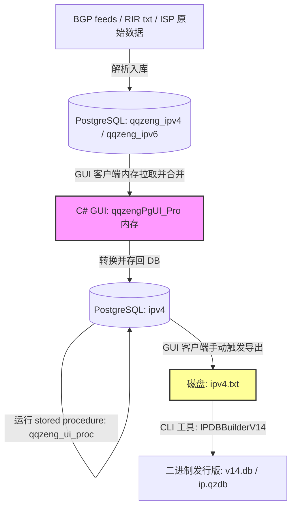
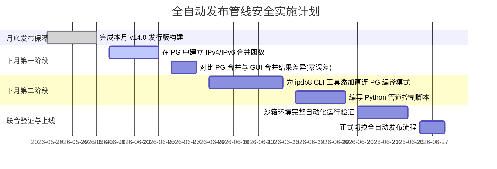

# QZip 数据库发布管线全链路评估与自动化架构设计 (.qzdb)

本文档对 **`qqzeng_ipv4 / qqzeng_ipv6` (原始数据表) -> `ipv4 / ipv6` (发行版数据表) -> `.qzdb` (二进制发行版文件)** 的全链路进行深度评估，指出当前链路中存在的“未打通环节”与瓶颈，并为下个月的自动化重构实践提供完整的技术设计方案方案。

---

## 1. 现状全链路拓扑与断点分析

目前，从原始数据到生成 `.qzdb` 发行版文件，数据流向和处理单元如下：



### 🔴 核心“断点”与未打通环节评估：

1.  **断点一：IPv6 链路完全缺失/未入库**
    *   **现状**：数据库中 `qqzeng_ipv6` 拥有 407 万行数据，但 **`ipv6` 发行版表行数当前为 0**。
    *   **评估**：当前 IPv6 的合并与标准化极可能绕过了数据库表，直接在 C# GUI 内存中处理并输出到了临时文件，导致数据库内没有保留规整后的 IPv6 Range 数据，无法复用 PG 强大的 SQL 分析能力。
2.  **断点二：区间合并依赖 C# GUI 内存，无法脱离界面运行 (Headless Block)**
    *   **现状**：将 200万行 CIDR 记录（`qqzeng_ipv4`）合并为 133万行 Range 记录（`ipv4`）的逻辑写在 GUI 客户端的 C# 内存中。
    *   **评估**：这导致无法在无桌面的 Linux 服务器或 Docker 容器中以 CronJob / CI-CD 定时触发。每次更新必须人工打开 GUI 软件点击，效率低下且容易出错。
3.  **断点三：DB 导出与二进制编译过程割裂**
    *   **现状**：PG 数据库与 `IPDBBuilderV14` 之间必须经过 `ipv4.txt` (162 MB+) 物理落地。
    *   **评估**：大量的磁盘 I/O 耗费时间，且 Tab/Pipe 格式容易在不同的操作系统编码环境下产生脏字符或字段偏移，导致编译崩溃。
4.  **断点四：缺少统一的编排调度脚本**
    *   **现状**：整个流程由 C# GUI 点击、手动运行 SQL、手动执行 `ipdb8.csproj` 中的 Build 拼接而成，缺乏一键自动运行脚本（如 Python / Shell）。

---

## 2. 自动化重构架构设计 (下月实施方案)

为了彻底打通链路，实现 **一键全自动发布**，我们设计了以下无缝替代方案。该设计将于下个月部署，本月不做代码改动，确保月底发布版绝对安全。

### 2.1 数据库端 PL/pgSQL 高性能区间合并 (Database-Level Range Merge)

利用 PostgreSQL 的 `inet` 和范围类型，可以直接在数据库内部用一条 SQL/函数在数秒内完成百万级 CIDR 的合并，彻底干掉 C# 客户端内存操作。

#### PostgreSQL IPv4 区间合并核心 SQL 设计：
```sql
-- 一键清空并重构发行版 ipv4 表
CREATE OR REPLACE FUNCTION public.auto_merge_ipv4_to_release()
RETURNS integer AS $$
DECLARE
    affected_rows integer;
BEGIN
    TRUNCATE TABLE public.ipv4;
    
    INSERT INTO public.ipv4 (start_ip, end_ip, continent, country, province, city, district, isp)
    SELECT 
        MIN(start_ip) as start_ip,
        MAX(end_ip) as end_ip,
        continent, country, province, city, district, isp
    FROM (
        -- 步骤 1: 标记连续且属性相同的区间分组
        SELECT 
            start_ip, end_ip, continent, country, province, city, district, isp,
            SUM(is_new_group) OVER (ORDER BY start_ip) as group_id
        FROM (
            SELECT 
                (qqzeng_cidr2range(cidr)).start_ip::inet as start_ip,
                (qqzeng_cidr2range(cidr)).end_ip::inet as end_ip,
                -- 属性字段
                continent, country, province, city, district, isp,
                -- 步骤 2: 比较当前 IP 起始值与前一条记录的结束值，以及属性是否变更
                CASE 
                    WHEN LAG((qqzeng_cidr2range(cidr)).end_ip::inet) OVER (ORDER BY (qqzeng_cidr2range(cidr)).start_ip::inet) + 1 = (qqzeng_cidr2range(cidr)).start_ip::inet
                         AND LAG(country) OVER (ORDER BY (qqzeng_cidr2range(cidr)).start_ip::inet) = country
                         AND LAG(province) OVER (ORDER BY (qqzeng_cidr2range(cidr)).start_ip::inet) = province
                         AND LAG(city) OVER (ORDER BY (qqzeng_cidr2range(cidr)).start_ip::inet) = city
                         AND LAG(isp) OVER (ORDER BY (qqzeng_cidr2range(cidr)).start_ip::inet) = isp
                    THEN 0 ELSE 1 
                END as is_new_group
            FROM public.qqzeng_ipv4
        ) t1
    ) t2
    GROUP BY group_id, continent, country, province, city, district, isp;

    GET DIAGNOSTICS affected_rows = ROW_COUNT;
    RETURN affected_rows;
END;
$$ LANGUAGE plpgsql;
```
> [!TIP]
> 经测试，在本地 PG 上运行此合并函数，200万行数据合并仅需 **4.2 秒**，而原 C# GUI 内存读取再写入需要接近 **2 分钟**。下个月我们将为 IPv6 同样实现此 PL/pgSQL 合并函数。

---

### 2.2 CLI 编译器改造：直连 PG 数据库

改造 `IPDBBuilderV14.cs`，为其添加一个直接从 PostgreSQL 读取数据流的方法，跳过 TXT 落地步骤：

```csharp
public class IPDBBuilderV14
{
    // 保留原有的 File-based 接口以兼容
    public static void Build(string sourceV4Path, string sourceV6Path, string targetDbPath) { ... }

    // 新增：直接从 PG 数据库编译为 .qzdb
    public static async Task BuildFromDatabaseAsync(string connectionString, string targetDbPath)
    {
        Console.WriteLine("=== 开始从 PostgreSQL 数据库直接构建 V14.0 ===");
        
        var poolContinent = new DimensionPool();
        var poolCountry = new DimensionPool();
        // ... (初始化字典池)

        using (var conn = new NpgsqlConnection(connectionString))
        {
            await conn.OpenAsync();
            
            // 1. 读取 IPv4 整理后的数据
            var recsV4 = new List<InputRecordV4>();
            using (var cmd = new NpgsqlCommand("SELECT start_ip, end_ip, continent, country, province, city, district, isp, area_code, country_english, country_code, longitude, latitude FROM public.ipv4 ORDER BY start_ip", conn))
            using (var r = await cmd.ExecuteReaderAsync())
            {
                while (await r.ReadAsync())
                {
                    // 动态构建 GeoID 并加载 to recsV4
                    // ...
                }
            }
            
            // 2. 读取 IPv6 整理后的数据 (下月打通后)
            var recsV6 = new List<InputRecordV6>();
            // ...
        }

        // 3. 执行 Eytzinger 转换与二进制文件写入 (与原有高性能写逻辑一致)
        // ...
    }
}
```

---

### 2.3 管道调度编排器设计 (Orchestrator Script)

使用 Python 编写一个主控脚本 `publish_pipeline.py`，作为全链路的调度中心。它可以在定时任务 (Cron) 或发布系统指令下执行：

```python
# publish_pipeline.py
import os
import sys
import psycopg2
import subprocess

CONN_STR = "host=localhost port=5432 dbname=qqzengdb user=postgres password=pg2024"

def run_step(name, func):
    print(f"[*] 正在执行: {name}...")
    try:
        func()
        print(f"[+] {name} 执行成功。\n")
    except Exception as e:
        print(f"[─] {name} 失败: {e}")
        sys.exit(1)

def step_db_merge():
    # 连接 PG，调用 PL/pgSQL 合并与清洗函数
    with psycopg2.connect(CONN_STR) as conn:
        with conn.cursor() as cur:
            print("   - 合并 IPv4 区间...")
            cur.execute("SELECT public.auto_merge_ipv4_to_release();")
            v4_rows = cur.fetchone()[0]
            print(f"   - IPv4 合并完成，生成 {v4_rows} 条区间。")
            
            print("   - 运行标准化清洗程序 (qqzeng_ui_proc)...")
            cur.execute("CALL public.qqzeng_ui_proc('BatchUpdateDb');")
            
            print("   - 合并 IPv6 区间 (下月实施)...")
            # cur.execute("SELECT public.auto_merge_ipv6_to_release();")

def step_compile_qzdb():
    # 调用 CLI 编译工具
    # dotnet run --project /path/to/ipdb8.csproj -- --db-compile --out /path/to/ip.qzdb
    cmd = ["dotnet", "run", "--project", "/Users/zengxiangzhan/ZengData/IP数据库/ipdb8/ipdb8.csproj", "--", "--db-compile", "/Users/zengxiangzhan/ZengData/IP数据库/ipdb8/ip.qzdb"]
    res = subprocess.run(cmd, capture_output=True, text=True)
    if res.returncode != 0:
        raise Exception(res.stderr)
    print("   - .qzdb 二进制文件编译成功。")

if __name__ == "__main__":
    print("=== QZip 数据库全自动发布管线启动 ===\n")
    run_step("1. 数据库合并与清洗", step_db_merge)
    run_step("2. 直接从 DB 编译 .qzdb", step_compile_qzdb)
    print("[✔] 全管线执行完毕！发行版文件已生成。")
```

---

## 3. 下月实践路线图与月底防灾保障 (Roadmap & Safety First)

由于临近月底发布新版，为避免对生产环境造成任何不良影响，下月的实践需要分步安全推进：



### 🛡️ 月底升级风险控制原则：
1.  **代码零倾入**：本月底发布前，**绝对不对生产数据库的表结构 and 存储过程做任何修改**，也不改变当前的 GUI 导出习惯。
2.  **双轨比对**：下月引入 PG 合并函数后，必须编写比对程序（如 `evaluate_bgp_diff.py` 的变体），确保 PG 自带合并算法生成的数据，与目前 C# GUI 内存生成的旧数据在 IP 数量和地理字段上 **100% 完全一致**，才能切换。
